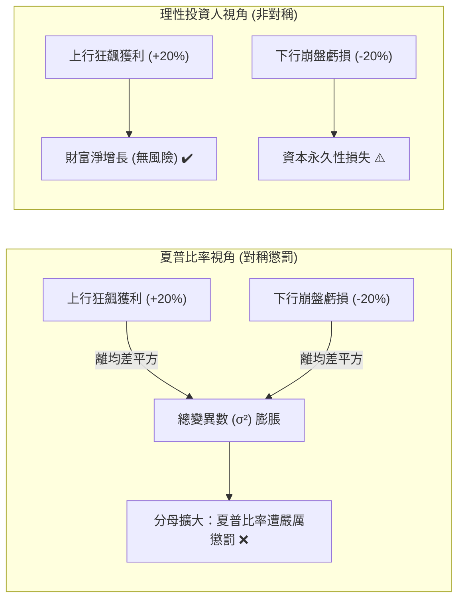

# 1.1 現代投資組合理論（MPT）與夏普比率的內在缺陷

> **理論分類**: 現代投資組合理論批判 (Critique of MPT)  
> **核心概念**: 均值-變異數優化 (MVO)、夏普比率 (Sharpe Ratio)、對稱風險懲罰悖論  
> **關聯模組**: [`engine/pmpt.py`](file:///home/cosmo_chang/Projects/asymmetric-defensive-equity-guide/engine/pmpt.py)  
> **單元測試**: [`tests/test_engine.py`](file:///home/cosmo_chang/Projects/asymmetric-defensive-equity-guide/tests/test_engine.py)

---

## 現代投資組合理論（MPT）的核心公理

自 Harry Markowitz 於 1952 年發表里程碑式的論文《Portfolio Selection》以來，現代投資組合理論（Modern Portfolio Theory, 簡稱 MPT）奠定了過去半個世紀學院派與華爾街資產配置的基石。Markowitz 框架建立於均值-變異數（Mean-Variance Optimization, MVO）之上，其核心假設可歸結為兩大公理：

1. **投資人為風險厭惡者（Risk-Averse）**：在給定預期回報下追求變異數極小化；或在給定變異數下追求預期回報極大化。
2. **資產回報率服從多元聯合常態分佈（Multivariate Normal Distribution）**：資產組合的分佈特徵可完全由前兩階動差——均值（Mean, $\mu$）與變異數（Variance, $\sigma^2$）——充分表徵。

基於此架構，William Sharpe 於 1966 年提出了廣為人知的夏普比率（Sharpe Ratio, 原名 Reward-to-Variability Ratio）：

$$\text{Sharpe Ratio} = \frac{\mathbb{E}[R_p] - R_f}{\sigma_p}$$

其中：
- $\mathbb{E}[R_p]$：投資組合預期報酬率；
- $R_f$：無風險利率（Risk-Free Rate）；
- $\sigma_p = \sqrt{\mathrm{Var}(R_p)}$：投資組合總回報的標準差。

---

## 夏普比率的統計偏誤：將「獲利波動」視為懲罰因子

在標準數學公式中，分母 $\sigma_p$ 的定義為：

$$\sigma_p = \sqrt{\frac{1}{T-1} \sum_{t=1}^T \left( R_{p,t} - \bar{R}_p \right)^2}$$

這意味著無論個別時期的回報 $R_{p,t}$ 是遠高於均值（狂飆獲利）還是遠低於均值（慘重崩跌），在經過離均差平方 $(R_{p,t} - \bar{R}_p)^2$ 的計算後，皆被無差別地賦予正向懲罰。

> [!WARNING]
> **對稱風險懲罰的悖論**：  
> 假設存在兩組策略 A 與 B：
> - **策略 A**：每月穩定獲利 1%，波動極低（標準差 $\sigma_A \approx 0.1\%$），幾乎無暴賺亦無暴賠。
> - **策略 B**：在保持下行受控（從不單月虧損超過 1%）的前提下，經常出現單月 +15%、+25% 的非對稱暴賺。
> 
> 在 MPT 與 Sharpe Ratio 的計算中，策略 B 由於上行爆發力帶來極高的樣本總變異數 $\sigma_B$，其計算出的夏普比率可能遠遠低於平庸的策略 A。這在經濟學與真實投資心理上是荒謬的——**理性投資人從不畏懼資產向上暴漲帶來的「波動」，他們唯一恐懼的是資產跌破安全底線的「下行虧損」**。

---

## 🎯 本節核心要點 (Key Takeaways)

1. **MPT 假定常態對稱**：均值-變異數理論仰賴二階動差充分性，將風險等同於總變異數。
2. **夏普比率誤傷上行收益**：公式中的離均差平方機制無法辨別「良性暴賺」與「惡性暴賠」，會懲罰追求正偏態的策略。
3. **現實世界的認知落差**：投資人真正的效用函數（Utility Function）具有高度非對稱性，僅對資本實質縮水產生負效用。

---

## 📚 相關文獻 (References)

- Markowitz, H. (1952). Portfolio selection. *The Journal of Finance*, 7(1), 77-91.
- Sharpe, W. F. (1966). Mutual fund performance. *The Journal of Business*, 39(1), 119-138.

---
👉 **下一節**：閱讀 [1.2 金融肥尾與非對稱分佈：高斯假設的崩潰](02-fat-tails-and-skewness.md)
