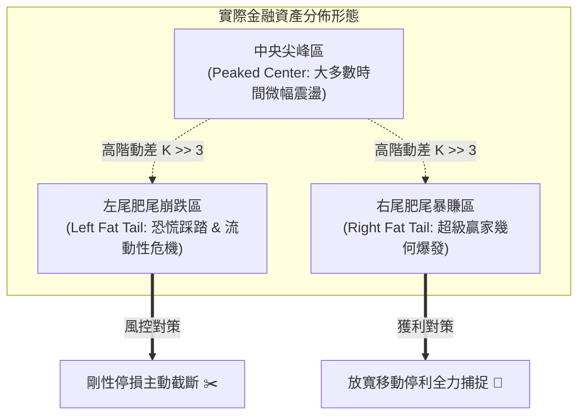

# 1.2 金融肥尾與非對稱分佈：高斯假設的崩潰

> **理論分類**: 實證資產定價與厚尾統計學 (Empirical Asset Pricing & Fat-Tailed Statistics)  
> **核心概念**: 尖峰肥尾 (Leptokurtosis)、列維穩定分佈 (Lévy Stable Distribution)、高階動差 (Higher Moments)  
> **關聯模組**: [`engine/pmpt.py`](file:///home/cosmo_chang/Projects/asymmetric-defensive-equity-guide/engine/pmpt.py)  
> **單元測試**: [`tests/test_engine.py`](file:///home/cosmo_chang/Projects/asymmetric-defensive-equity-guide/tests/test_engine.py)

---

## 高斯假設的根本盲點

Markowitz 框架的第二個致命盲點在於常態分佈假設。Benoit Mandelbrot (1963) 在對棉花期貨與資產價格變動的開創性研究中首次指出：金融資產價格回報絕非高斯分佈，而是呈現顯著的「列維穩定分佈（Lévy Stable Distribution）」或稱**厚尾/肥尾特性（Fat Tails, Leptokurtosis）**。

Eugene Fama (1965) 隨後在股票市場的研究中進一步證實，極端值發生的頻率遠高於常態分佈預測。金融市場的極端黑天鵝事件在統計學上並非幾萬年一遇，而是呈現冪律衰減（Power-law Decay）。

---

## 常態分佈 vs 實際金融回報分佈之對比

| 分佈統計特徵 | 高斯常態分佈（MPT 假設） | 實際金融資產分佈（Empirical Reality） | 策略意義與潛在危害 |
| :--- | :--- | :--- | :--- |
| **偏態（Skewness, $S$）** | $S = 0$（嚴格左右對稱） | $S \neq 0$（美股個股偏右偏態，宏觀指數偏左偏態） | 對稱模型忽視了極端下行崩盤（Crash Risk）的衝擊 |
| **峰態（Kurtosis, $K$）** | $K = 3$（無超額峰度） | $K \gg 3$（超額厚尾 Leptokurtic） | 3 個標準差（$3\sigma$）以上的極端黑天鵝事件頻率高出理論值數百倍 |
| **二階動差充分性** | 均值與變異數即決定全部資訊 | 必須考量高階動差（偏態、峰度與下行半變異數） | 依賴變異數優化將導致組合在系統性危機中遭受毀滅性打擊 |

---

## 尖峰肥尾分佈概念圖

當資產回報分佈偏離常態時，變異數失去了作為風險度量尺規的正當性。特別是在具備「嚴格停損、極度放寬停利」的非對稱交易體系中，回報分佈被人為地塑造成顯著的**正偏態（Positive Skewness）**。

在此情境下，若沿用夏普比率評估策略績效，將導致嚴重的模型誤判與無效去槓桿。

---

## 🎯 本節核心要點 (Key Takeaways)

1. **金融回報絕非高斯分佈**：實際市場呈現高度尖峰厚尾（$K \gg 3$），極端事件發生機率遠超常態預測。
2. **指數與個股偏態各異**：大盤指數常面臨左偏崩盤風險，而個股長期回報則呈現極度右偏。
3. **主動重塑分佈輪廓**：非對稱策略的核心在於透過規則截斷左側厚尾，並將收益分佈重塑為正偏態。

---

## 📚 相關文獻 (References)

- Fama, E. F. (1965). The behavior of stock-market prices. *The Journal of Business*, 38(1), 34-105.
- Mandelbrot, B. (1963). The variation of certain speculative prices. *The Journal of Business*, 36(4), 394-419.

---
👉 **下一節**：閱讀 [1.3 索提諾比率的數學嚴格推導與目標函數優化](03-sortino-ratio-derivation.md)
