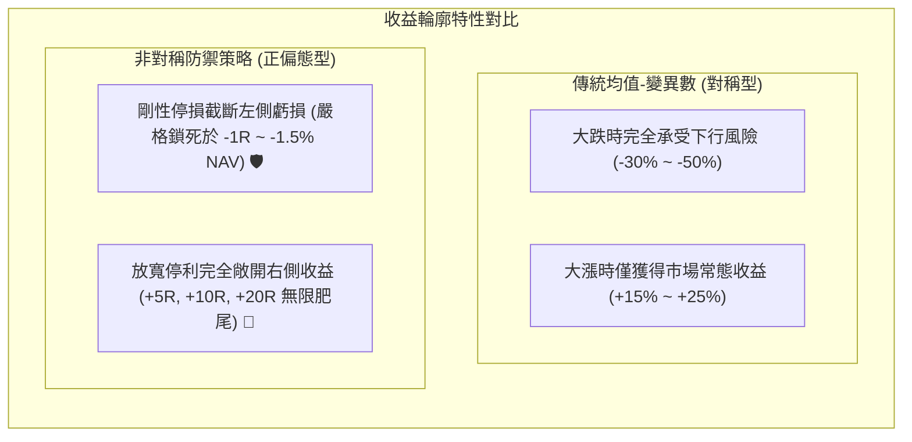
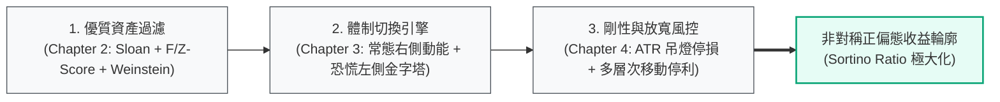

# 1.4 長線持有與非對稱收益輪廓的構建

> **理論分類**: 投資組合建構與工程架構 (Portfolio Construction & System Engineering)  
> **核心概念**: 索提諾目標函數、非對稱收益輪廓 (Asymmetric Payoff)、正偏態幾何複利  
> **關聯模組**: [`engine/pmpt.py`](file:///home/cosmo_chang/Projects/asymmetric-defensive-equity-guide/engine/pmpt.py)  
> **單元測試**: [`tests/test_engine.py`](file:///home/cosmo_chang/Projects/asymmetric-defensive-equity-guide/tests/test_engine.py)

---

## 傳統買入持有 vs 高頻主動交易之困境

在傳統投資實務中，「買入並持有（Buy and Hold, B&H）」策略常被批評為缺乏防禦性，因其完全暴露於大盤系統性崩盤（如 1929、2000、2008 年）的深淵之中；而「高頻主動交易」則因高昂的換手成本（Turnover Costs）、滑點（Slippage）以及繳稅摩擦，長期損耗幾何複利。

本書提出的架構旨在透過後現代投資組合優化，將**長線持有的低摩擦優勢**與**下行截斷的非對稱性**融合。

---

## 資產配置的最優化目標函數

對於由 $N$ 檔美股構成的投資權重向量 $\mathbf{w} = [w_1, w_2, \dots, w_N]^T$：

### 傳統 Markowitz 目標函數
$$\max_{\mathbf{w}} \quad \mathbf{w}^T \boldsymbol{\mu} - \frac{\lambda}{2} \mathbf{w}^T \boldsymbol{\Sigma} \mathbf{w} \quad \text{s.t.} \quad \sum_{i=1}^N w_i = 1, \; w_i \ge 0$$

### 後現代非對稱防禦型架構的目標函數
$$\max_{\mathbf{w}} \quad \text{Sortino}(\mathbf{w}; MAR) = \frac{\mathbf{w}^T \boldsymbol{\mu} - MAR}{\sqrt{\frac{1}{T} \sum_{t=1}^T \left[ \min\left(0, \mathbf{w}^T \mathbf{R}_t - MAR\right) \right]^2}}$$

$$\text{Subject to:} \quad \sum_{i=1}^N w_i \le 1, \quad 0 \le w_i \le w_{\max}, \quad \forall i$$

---

## 非對稱收益輪廓 (Payoff Profile)

---

## 非對稱收益的分佈特徵：三位一體工程實現途徑

要使得投資組合的實證分佈具備上述「左側截斷、右側無限肥尾」的正偏態幾何特徵，系統必須依賴三個有機鏈結的模組協同運作：

1. **優質資產過濾（Chapter 2）**：挑選出具備定價權、極高投入資本回報率（ROIC）與真實真實現金流支撐的頂級企業，確保資產在長期持有時內生價值持續增長；
2. **體制切換引擎（Chapter 3）**：在市場趨勢健康時順勢捕捉動能，在極端黑天鵝降臨時不盲目割肉，而是切入左側價值積累；
3. **剛性與放寬風控（Chapter 4）**：一旦個股判斷錯誤跌破波動度防護罩，立即嚴厲停損（Truncate Left Tail）；一旦趨勢確立，絕不預設天花板，放任獲利奔馳（Let Profits Run）。

---

## 🎯 本節核心要點 (Key Takeaways)

1. **鎖定下行、放開上行**：非對稱收益的核心目標是將下行虧損控制為微小的常數，將上行潛力最大化。
2. **多模組系統工程**：單靠技術指標或單靠基本面無法實現正偏態，必須透過資產篩選、體制切換與部位風控三位一體無縫整合。
3. **低換手與複利維護**：在主升浪中耐心持有優質資產，消除無謂的短線換手損耗與摩擦成本。

---

## 📚 相關文獻 (References)

- Sortino, F. A., & Price, L. N. (1994). Performance measurement in a downside risk framework. *The Journal of Investing*, 3(3), 59-64.

---
👉 **章節總結**：第一章完畢，接下來進入 [第二章：標的挑選體系——基本面因子與技術面過濾](../02-asset-selection/README.md)
