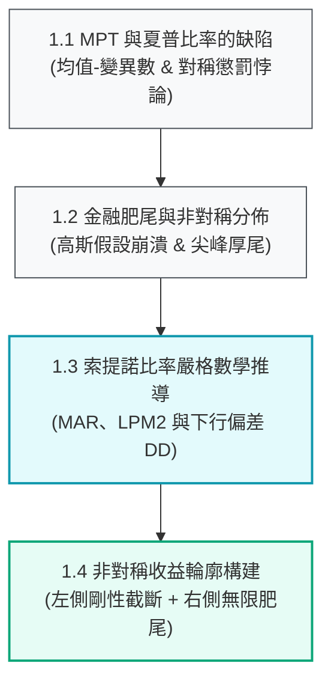

# 第一章：核心哲學——後現代投資組合理論與索提諾比率

> 「投資組合的真正風險，絕非源於資產價格向上暴漲時帶來的波動，而是來自於資本永久性虧損與無法達成財務目標的下行衝擊。」  
> —— **Frank A. Sortino (1994)**

---

## 📌 章節概覽與學習目標

在現代金融市場中，傳統均值-變異數理論（Markowitz Mean-Variance Optimization, 1952）與夏普比率（Sharpe Ratio, 1966）長期佔據教科書核心。然而，傳統框架建立在「回報服從對稱高斯常態分佈」的假設上，**將向上賺錢的波動與向下虧損的波動等同視為風險予以懲罰**。

本章將帶領讀者徹底跳脫對稱風險懲罰的思維桎梏，全面轉向以**後現代投資組合理論（Post-Modern Portfolio Theory, PMPT）**為核心基石的交易與配置體系，為後續章節的選股、體制切換與非對稱風控奠定堅實的數學與哲學基礎。

### 🎯 核心學習目標
1. **洞悉夏普比率的對稱性懲罰缺陷**：理解為何追求夏普比率最大化會誤殺具備爆發性正偏態收益的優質策略。
2. **理解金融肥尾與非對稱分佈**：掌握 Mandelbrot 與 Fama 揭示的金融資產高階動差（偏態與超額峰度）特徵。
3. **精通索提諾比率的嚴格數學模型**：掌握二階下行偏動差（$LPM_2$）與離散下行偏差（$DD$）的推導邏輯與自由度辨析。
4. **確立非對稱收益輪廓的構建途徑**：理解如何將「長線持有的低摩擦」與「剛性停損的左側截斷」融合成正偏態收益曲線。

---

## 🗺️ 章節架構地圖

---

## 📑 子章節導覽

| 章節編號 | 單元名稱 | 核心論點與理論依據 | 對應 Python 代碼模組 |
| :--- | :--- | :--- | :--- |
| **[1.1](01-mpt-and-sharpe-flaws.md)** | [MPT 與夏普比率的內在缺陷](01-mpt-and-sharpe-flaws.md) | Markowitz (1952)、Sharpe (1966)；分析離均差平方對獲利波動的懲罰悖論 | [`engine/pmpt.py`](file:///home/cosmo_chang/Projects/asymmetric-defensive-equity-guide/engine/pmpt.py) |
| **[1.2](02-fat-tails-and-skewness.md)** | [金融肥尾與非對稱分佈](02-fat-tails-and-skewness.md) | Mandelbrot (1963)、Fama (1965)；高斯常態分佈 vs 實際肥尾偏態特徵對比 | [`engine/pmpt.py`](file:///home/cosmo_chang/Projects/asymmetric-defensive-equity-guide/engine/pmpt.py) |
| **[1.3](03-sortino-ratio-derivation.md)** | [索提諾比率推導與優化](03-sortino-ratio-derivation.md) | Sortino & van der Meer (1991)、Sortino & Price (1994)；$LPM_2$ 與 $DD$ 連續/離散公式 | [`engine/pmpt.py`](file:///home/cosmo_chang/Projects/asymmetric-defensive-equity-guide/engine/pmpt.py) |
| **[1.4](04-asymmetric-payoff-profile.md)** | [長線持有與非對稱收益輪廓](04-asymmetric-payoff-profile.md) | PMPT 最佳化目標函數與正偏態幾何收益輪廓的工程實現途徑 | [`engine/pmpt.py`](file:///home/cosmo_chang/Projects/asymmetric-defensive-equity-guide/engine/pmpt.py) |

---
👉 **開始閱讀**：進入 [1.1 現代投資組合理論（MPT）與夏普比率的內在缺陷](01-mpt-and-sharpe-flaws.md)
