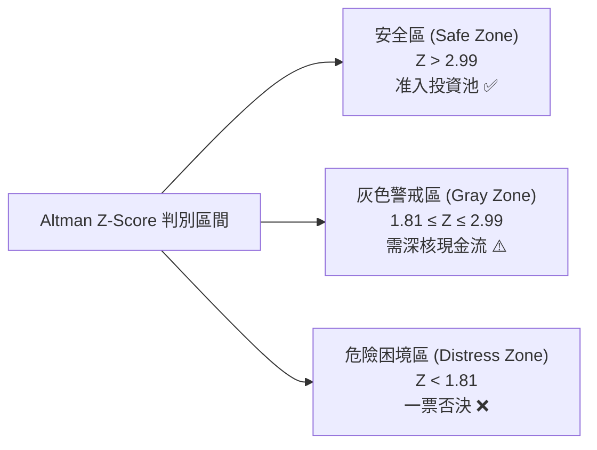

# 2.1 獲利品質與財務韌性：Sloan 應計、Piotroski F-Score 與 Altman Z-Score

> **理論分類**: 實證會計學與信用風險定價 (Empirical Accounting & Credit Risk)  
> **核心概念**: 應計利潤異象 (Accrual Anomaly)、財務體質評分 ($F\text{-Score}$)、破產預警 ($Z\text{-Score}$)  
> **關聯模組**: [`engine/screening.py`](file:///home/cosmo_chang/Projects/asymmetric-defensive-equity-guide/engine/screening.py)  
> **單元測試**: [`tests/test_engine.py`](file:///home/cosmo_chang/Projects/asymmetric-defensive-equity-guide/tests/test_engine.py)

---

## 建立基本面防護網的迫切性

在建構防禦型股票池時，首先面臨的挑戰是企業「會計報表的可信度」與「下行信用破產風險」。實證研究反覆證明，單純依賴歷史每股盈餘（EPS）或本益比（P/E）會掉入嚴重的「價值陷阱（Value Trap）」。

本體系透過三道量化防火牆進行嚴密的基本面初篩。

---

## 1. Sloan (1996) 應計利潤異象（Accrual Anomaly）

Richard Sloan 於 1996 年發表於 *The Accounting Review* 的經典論文指出：**會計盈餘由現金流與應計利潤（Accruals）兩大部分組成，應計利潤佔比過高的公司，其未來的盈餘持續性（Earnings Persistence）顯著低於以真實營業現金流主導的公司**。市場往往系統性地高估高應計公司的盈餘質量，導致其股價在隨後數期面臨均值回歸與負向超額回報。

### 數學定義與標準化計算
採用資產負債表法（Balance Sheet Approach）或現金流量表法，資產負債表應計利潤總額定義為：

$$\text{Accruals}_t = (\Delta \text{CA}_t - \Delta \text{Cash}_t) - (\Delta \text{CL}_t - \Delta \text{STD}_t) - \text{Dep}_t$$

為消除公司規模效應，依據 Sloan 經典架構除以期初與期末總資產平均值 $\text{TotalAssets}_{\text{avg}}$：

$$\text{Sloan Accrual Ratio} = \frac{\text{Accruals}_t}{\text{TotalAssets}_{\text{avg}}}$$

其中：
- $\Delta \text{CA}$：流動資產變動額（Change in Current Assets）；
- $\Delta \text{Cash}$：現金及約當現金變動額（Change in Cash and Equivalents）；
- $\Delta \text{CL}$：流動負債變動額（Change in Current Liabilities）；
- $\Delta \text{STD}$：包含於流動負債之短期借款與應付票據變動額（Change in Short-Term Debt）；
- $\text{Dep}$：當期折舊與攤銷費用（Depreciation and Amortization Expense）。

> [!CAUTION]
> **應計利潤過濾門檻**：  
> 當企業的 $\text{Sloan Accrual Ratio} > 0.10$（即應計利潤超過總資產 10%）時，代表企業帳面利潤大量由未變現之應收帳款或存貨積壓灌水而成，該標的一律自選股池剔除。

---

## 2. Piotroski (2000) $F\text{-Score}$ 財務體質篩選模型

史丹佛大學會計學教授 Joseph Piotroski 於 2000 年提出 $F\text{-Score}$ 模型，透過 9 個二元變數（0 或 1）對公司的獲利能力（Profitability）、槓桿與流動性（Leverage, Liquidity and Source of Funds）以及營運效率（Operating Efficiency）進行全面體檢：

### 表 2-1: Piotroski $F\text{-Score}$ 9 項評分指標拆解

| 維度 | 指標代號 | 財務指標與計算方式 | 評分條件（1分條件） | 經濟意義與審計目的 |
| :--- | :--- | :--- | :--- | :--- |
| **獲利能力 (Profitability)** | $F_1$ | 資產報酬率 $\text{ROA}_t = \frac{\text{Net Income}_t}{\text{Total Assets}_{t-1}}$ | $\text{ROA}_t > 0$ | 確保底層資產具備產生淨正收益能力 |
| | $F_2$ | 營業現金流量 $\text{CFO}_t$ | $\text{CFO}_t > 0$ | 杜絕無現金流入的虛胖帳面利潤 |
| | $F_3$ | $\text{ROA}$ 變動值 $\Delta \text{ROA} = \text{ROA}_t - \text{ROA}_{t-1}$ | $\Delta \text{ROA} > 0$ | 檢驗資本回報之邊際改善動能 |
| | $F_4$ | 盈餘品質（Cash Flow vs Accrual） | $\text{CFO}_t > \text{Net Income}_t$ | 確保現金流高於淨利（排除會計操縱） |
| **槓桿/流動性 (Leverage & Liquidity)** | $F_5$ | 長期槓桿率變動 $\Delta \text{LEV} = \text{LEV}_t - \text{LEV}_{t-1}$ | $\Delta \text{LEV} < 0$ | 長期負債比率下降，降低償債壓力 |
| | $F_6$ | 流動比率變動 $\Delta \text{CR} = \text{CR}_t - \text{CR}_{t-1}$ | $\Delta \text{CR} > 0$ | 短期流動性防禦能力提升 |
| | $F_7$ | 新增股本發行 $\text{EQ\_OFFER}_t$ | 無增發新股（Shares $\le 0$） | 避免每股盈餘被稀釋或透過增資續命 |
| **營運效率 (Operating Efficiency)** | $F_8$ | 毛利率變動 $\Delta \text{Margin} = \text{Margin}_t - \text{Margin}_{t-1}$ | $\Delta \text{Margin} > 0$ | 展現企業產品定價權與成本轉嫁能力 |
| | $F_9$ | 資產周轉率變動 $\Delta \text{Turn} = \text{Turn}_t - \text{Turn}_{t-1}$ | $\Delta \text{Turn} > 0$ | 資本配置效率與庫存銷售周轉提升 |

總評分定義為各子項之和：

$$F\text{-Score} = \sum_{i=1}^9 F_i, \quad F\text{-Score} \in \{0, 1, 2, \dots, 9\}$$

> [!NOTE]
> **選股閾值**：  
> - **常態體制（動能右側交易）**：要求 $F\text{-Score} \ge 7$；  
> - **極端壓力體制（左側反向抄底）**：要求 $F\text{-Score} \ge 8$（確保標的具備度過流動性寒冬的極致資產負債表韌性）。

---

## 3. Altman (1968) $Z\text{-Score}$ 破產風險過濾

Edward Altman 於 1968 年利用多元判別分析（Multiple Discriminant Analysis, MDA）建立的 $Z\text{-Score}$ 模型，是評估製造業與公用/一般企業違約風險的黃金標竿：

$$Z = 1.2 X_1 + 1.4 X_2 + 3.3 X_3 + 0.6 X_4 + 0.999 X_5$$

其中：
- $X_1 = \frac{\text{營運資金 (Working Capital)}}{\text{總資產 (Total Assets)}}$：短期流動資本充足度；
- $X_2 = \frac{\text{保留盈餘 (Retained Earnings)}}{\text{總資產 (Total Assets)}}$：長期累積獲利與資本公積蓄積程度；
- $X_3 = \frac{\text{息稅前利潤 (EBIT)}}{\text{總資產 (Total Assets)}}$：真實資產營運獲利產出效率；
- $X_4 = \frac{\text{股票總市值 (Market Value of Equity)}}{\text{總負債 (Total Liabilities)}}$：股權價值對債務本金的緩衝覆蓋倍數；
- $X_5 = \frac{\text{營業收入 (Sales)}}{\text{總資產 (Total Assets)}}$：資產周轉倍數。

---

## 🎯 本節核心要點 (Key Takeaways)

1. **應計利潤比率 $\le 0.10$**：徹底排除依靠應收帳款與存貨虛增營收的財報地雷股。
2. **$F\text{-Score} \ge 7$ 或 $8$**：透過獲利、流動性與運營效率三維度檢驗，常態多頭需達 7 分，逆勢抄底必須達 8 分。
3. **$Z\text{-Score} < 1.81$ 絕對否決**：嚴厲拒絕陷入財務困境或違約破產風險的公司。

---

## 📚 相關文獻 (References)

- Altman, E. I. (1968). Financial ratios, discriminant analysis and the prediction of corporate bankruptcy. *The Journal of Finance*, 23(4), 589-609.
- Piotroski, J. D. (2000). Value investing: The use of historical financial statement information to separate winners from losers. *Journal of Accounting Research*, 38, 1-41.
- Sloan, R. G. (1996). Do stock prices fully reflect information in accruals and cash flows about future earnings? *The Accounting Review*, 71(3), 289-315.

---
👉 **下一節**：閱讀 [2.2 競爭優勢與資本回報：Fama-French、ROIC 與 FCF Yield](02-capital-return-and-moat.md)
