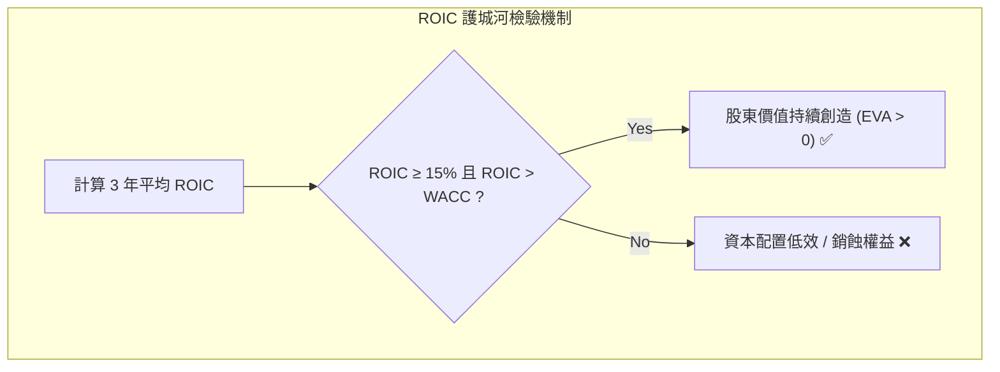

# 2.2 競爭優勢與資本回報：Fama-French 五因子、ROIC 與 FCF Yield

> **理論分類**: 現代實證資產定價與企業價值創造 (Empirical Asset Pricing & Value Creation)  
> **核心概念**: Fama-French 五因子、投入資本回報率 (ROIC)、自由現金流收益率 (FCF Yield)、經濟附加價值 (EVA)  
> **關聯模組**: [`engine/screening.py`](file:///home/cosmo_chang/Projects/asymmetric-defensive-equity-guide/engine/screening.py)  
> **單元測試**: [`tests/test_engine.py`](file:///home/cosmo_chang/Projects/asymmetric-defensive-equity-guide/tests/test_engine.py)

---

## 1. Fama & French (2015) 五因子模型之啟示

Eugene Fama 與 Kenneth French 於 2015 年在三因子基礎上擴充為五因子模型：

$$\mathbb{E}[R_{it}] - R_{ft} = \alpha_i + \beta_{i1} \text{MKT}_t + \beta_{i2} \text{SMB}_t + \beta_{i3} \text{HML}_t + \beta_{i4} \text{RMW}_t + \beta_{i5} \text{CMA}_t + \epsilon_{it}$$

其中核心貢獻為兩大品質因子：
- **獲利因子（ $\text{RMW}_t$ , Robust Minus Weak）**：高營運獲利率（Robust Profitability）企業長期系統性跑贏低營運獲利率（Weak Profitability）企業；
- **投資因子（ $\text{CMA}_t$ , Conservative Minus Aggressive）**：保守再投資（Conservative Investment）企業長期系統性跑贏激進資本擴張（Aggressive Investment）企業。

實證結果清楚揭示：盲目進行低效併購與激進資本支出的企業會摧毀股東權益，而具備深厚經濟護城河、穩健再投資且具備優異獲利能力的公司，能持續產生超額阿爾法。

---

## 2. 投入資本回報率（ROIC）與自由現金流收益率（FCF Yield）

為了精確量化 RMW 與 CMA 在微觀企業層級的表現，策略引入兩大核心門檻：

### 投入資本回報率（Return on Invested Capital, ROIC）

$$\text{ROIC} = \frac{\text{NOPAT}}{\text{Invested Capital}} = \frac{\text{EBIT} \times (1 - \tau)}{(\text{Total Debt} + \text{Shareholders' Equity} - \text{Excess Cash})}$$

其中 $\tau$ 為邊際企業所得稅率。

> [!NOTE]
> **選拔門檻**：近 3 年平均 $\text{ROIC} \ge 15\%$ ，且 $\text{ROIC} > \text{WACC}$ （加權平均資本成本），確保公司處於真正的股東價值創造（Economic Value Added, EVA）區間。

---

### 自由現金流收益率（Free Cash Flow Yield）

$$\text{FCF Yield} = \frac{\text{FCF}}{\text{Enterprise Value}} = \frac{\text{CFO} - \text{CapEx}}{\text{Market Cap} + \text{Net Debt}}$$

自由現金流是企業支付利息、配發股利、回購股票及抗禦經濟蕭條的真金白銀：

> [!IMPORTANT]
> **選拔門檻**：  
> 1. 持續 3 年 $\text{FCF} > 0$ （嚴禁需要外部融資燒錢補血的公司）；  
> 2. 過去 12 個月（TTM） $\text{FCF Yield} \ge 4.0\%$ （極端高成長科技板塊至少放寬至 $\text{FCF Yield} \ge 2.0\%$ ）。

---

## 🎯 本節核心要點 (Key Takeaways)

1. **RMW 與 CMA 的微觀映射**：穩健高獲利（Robust）與克制資本支出（Conservative）是企業長期勝出的兩大源泉。
2. **ROIC** $\ge 15\%$ ：確保企業具備深厚定價權與高投入回報率，能抵禦通膨與成本上升壓力。
3. **現金流造血能力**：自由現金流收益率（FCF Yield）是戳破帳面利潤泡沫的最硬性指標。

---

## 📚 相關文獻 (References)

- Fama, E. F., & French, K. R. (2015). A five-factor asset pricing model. *Journal of Financial Economics*, 116(1), 1-22.

---
👉 **下一節**：閱讀 [2.3 技術面輔助驗證：Weinstein 階段與 200 SMA 趨勢濾網](03-technical-filters-and-stages.md)
