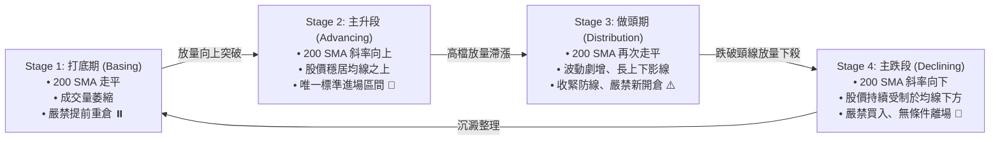

# 2.3 技術面輔助驗證：Stan Weinstein 四階段與 200 SMA 趨勢濾網

> **理論分類**: 價格動能與技術結構實證 (Price Action & Technical Structures)  
> **核心概念**: Weinstein 四階段分析 (Stage Analysis)、200 日移動平均線 (200 SMA)、動能時機確認  
> **關聯模組**: [`engine/screening.py`](file:///home/cosmo_chang/Projects/asymmetric-defensive-equity-guide/engine/screening.py)  
> **單元測試**: [`tests/test_engine.py`](file:///home/cosmo_chang/Projects/asymmetric-defensive-equity-guide/tests/test_engine.py)

---

## 為什麼需要技術面過濾？

純粹的基本面分析存在顯著的「時機鈍化」問題——一家本益比極低、獲利極佳的頂級公司，可能在長達數年的時間內處於橫盤沉睡期，或受制於整體板塊資金撤離而持續陰跌。

本架構以經典的市場結構理論與長線均線作為進場時機濾網。

---

## 1. Stan Weinstein (1988) 四階段市場週期分析（Stage Analysis）

Stan Weinstein 在經典著作中將股票市場走勢劃分為四個本質截然不同的生命週期階段：

### 表 2-2: Stan Weinstein 四階段特徵與策略動作對照表

| 階段名稱 | 均線走勢（200-day SMA / 30-week MA） | 交易量與結構特徵 | 策略執行動作 |
| :--- | :--- | :--- | :--- |
| **Stage 1: 打底期** | 長期均線走平，股價在均線上下窄幅震盪 | 交易量萎縮，買賣雙方趨於均衡 | 列入觀察名單，**嚴禁提前重倉進場** |
| **Stage 2: 主升段** | 均線明確向上傾斜，股價穩定站於均線之上 | 突破時伴隨顯著放大成交量，回測支撐不破 | **唯一的右側策略標準進場階段** |
| **Stage 3: 做頭期** | 均線再度走平，波動率劇增，頻現長上下影線 | 高檔爆量不漲，籌碼由機構流向散戶 | 嚴禁新開倉，收緊停利防線 |
| **Stage 4: 主跌段** | 均線向下傾斜，股價持續受制於均線下方 | 反彈皆為弱勢，持續破底 | **嚴禁任何買入操作，若持有無條件離場** |

---

## 2. Brock, Lakonishok, & LeBaron (1992) 200 日移動平均線（200-day SMA）

William Brock、Josef Lakonishok 與 Blake LeBaron 於 1992 年發表於 *The Journal of Finance* 的里程碑實證研究《Simple Technical Trading Rules and the Stochastic Properties of Stock Returns》，運用道瓊工業指數長達 90 年的數據，證實以 200 日移動平均線為代表的移動平均規則具備高度顯著的非隨機預測力。

### 數學定義與操作鐵律：

$$\text{SMA}_{200}(t) = \frac{1}{200} \sum_{k=0}^{199} P_{t-k}$$

$$\text{Trend Filter Condition}: \quad P_t > \text{SMA}_{200}(t) \quad \text{AND} \quad \frac{d}{dt}\text{SMA}_{200}(t) > 0$$

> [!WARNING]
> **趨勢絕對濾網**：  
> 在常態多頭體制中，若標的股票現價 $P_t < \text{SMA}_{200}(t)$ ，無論其本益比多便宜、基本面評分多優異，**一律嚴禁建立右側多頭部位**，徹底排除「試圖在主跌浪中接飛刀」的人性弱點。

---

## 🎯 本節核心要點 (Key Takeaways)

1. **僅在 Stage 2 做多**：主升段是資金效率最高的階段，Stage 1 容易耗盡耐心，Stage 3/4 存在致命回撤風險。
2. **200 SMA 絕對濾網**：股價位於 200 SMA 下方時禁止任何右側買入，杜絕逆勢抄底的僥倖心理。
3. **量價突破確認**：突破基底必須伴隨成交量放大，證明機構主力的實質買盤介入。

---

## 📚 相關文獻 (References)

- Brock, W., Lakonishok, J., & LeBaron, B. (1992). Simple technical trading rules and the stochastic properties of stock returns. *The Journal of Finance*, 47(5), 1731-1764.
- Weinstein, S. (1988). *Stan Weinstein's Secrets for Profiting in Bull and Bear Markets*. McGraw-Hill.

---
👉 **下一節**：閱讀 [2.4 多維度標的初篩決策矩陣與篩選管線](04-screening-matrix-and-pipeline.md)
