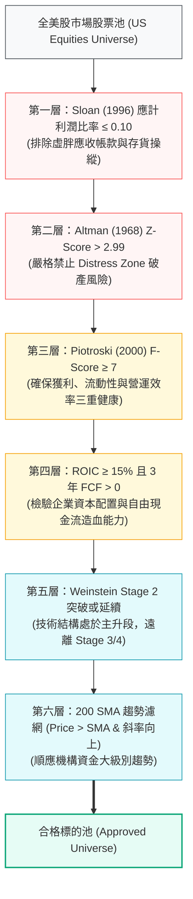

# 第二章：標的挑選體系——基本面因子與技術面過濾

> 「價值投資與動能投資並非互斥的信仰，而是不同時間尺度下對基本面真實盈餘品質與價格傳導時滯的度量。」  
> —— **Empirical Asset Pricing Insights**

---

## 📌 章節概覽與學習目標

在防禦型股票池的建構過程中，最常見的陷阱是「價值陷阱（Value Trap）」與「作帳地雷（Accounting Fraud）」。單純依賴低本益比（P/E）或高殖利率往往會選入即將面臨信用降評甚至破產的劣質資產。

本章建立一套工業級的**多維度漏斗篩選管線（Multi-Tiered Screening Pipeline）**，在進入右側交易或左側價值建倉前，透過三道會計信用防火牆、兩大護城河回報指標，以及 Stan Weinstein 技術結構濾網，對全市場美股進行嚴格篩選。

### 🎯 核心學習目標
1. **識破會計操縱與信用破產隱患**：掌握 Sloan (1996) 應計利潤比率、Piotroski (2000) $F\text{-Score}$ 9 項評分及 Altman (1968) $Z\text{-Score}$ 違約警戒分區。
2. **量化經濟護城河與資本回報**：依據 Fama-French 五因子模型中的獲利因子（RMW）與投資因子（CMA），設定嚴格的 ROIC 與自由現金流（FCF Yield）標準。
3. **消除時機鈍化之技術濾網**：掌握 Stan Weinstein 四階段週期轉折與 Brock et al. 200 日移動平均線（200 SMA）絕對趨勢門檻。
4. **掌握全自動化篩選演算法**：理解並能執行 [`engine/screening.py`](file:///home/cosmo_chang/Projects/asymmetric-defensive-equity-guide/engine/screening.py) 提供的標的過濾流程。

---

## 🗺️ 六層漏斗式標的篩選架構

---

## 📑 子章節導覽

| 章節編號 | 單元名稱 | 核心論點與理論依據 | 對應 Python 代碼模組 |
| :--- | :--- | :--- | :--- |
| **[2.1](01-accounting-quality-and-resilience.md)** | [獲利品質與財務韌性](01-accounting-quality-and-resilience.md) | Sloan (1996)、Piotroski (2000)、Altman (1968)；會計應計比率、F-Score 9 項評分表與破產安全區 | [`engine/screening.py`](file:///home/cosmo_chang/Projects/asymmetric-defensive-equity-guide/engine/screening.py) |
| **[2.2](02-capital-return-and-moat.md)** | [競爭優勢與資本回報](02-capital-return-and-moat.md) | Fama & French (2015) 五因子、投入資本回報率（ROIC）與自由現金流收益率（FCF Yield） | [`engine/screening.py`](file:///home/cosmo_chang/Projects/asymmetric-defensive-equity-guide/engine/screening.py) |
| **[2.3](03-technical-filters-and-stages.md)** | [技術面輔助驗證](03-technical-filters-and-stages.md) | Stan Weinstein (1988) 四階段週期模型、Brock et al. (1992) 200 SMA 趨勢濾網 | [`engine/screening.py`](file:///home/cosmo_chang/Projects/asymmetric-defensive-equity-guide/engine/screening.py) |
| **[2.4](04-screening-matrix-and-pipeline.md)** | [多維度標的初篩決策矩陣](04-screening-matrix-and-pipeline.md) | 綜合初篩矩陣、篩選演算法偽代碼與端到端過濾管線實作 | [`engine/screening.py`](file:///home/cosmo_chang/Projects/asymmetric-defensive-equity-guide/engine/screening.py) |

---
👉 **開始閱讀**：進入 [2.1 獲利品質與財務韌性：Sloan 應計、F-Score 與 Z-Score](01-accounting-quality-and-resilience.md)
