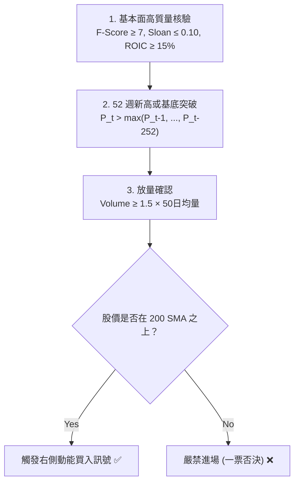

# 3.2 常態環境：右側交易（Momentum & Trend Following）

> **理論分類**: 價格動能與趨勢跟隨 (Price Momentum & Trend Following)  
> **核心概念**: 橫斷面動能 (Cross-Sectional Momentum)、時間序列動能 (TSMOM)、52週新高突破、成交量確認  
> **關聯模組**: [`engine/regime.py`](file:///home/cosmo_chang/Projects/asymmetric-defensive-equity-guide/engine/regime.py)  
> **單元測試**: [`tests/test_engine.py`](file:///home/cosmo_chang/Projects/asymmetric-defensive-equity-guide/tests/test_engine.py)

---

## 理論支撐：橫斷面動能與時間序列動能

在常態多頭體制中，市場價格反映資訊具有持續的延遲擴散效應（Information Diffusion Delay），動能效應展現高度穩健的風險溢價：

- **Jegadeesh & Titman (1993)** 在發表於 *The Journal of Finance* 的經典文獻《Returns to Buying Winners and Selling Losers: Implications for Stock Market Efficiency》中證明：過去 3 至 12 個月表現最佳的股票組合（Winners），在隨後的 3 至 12 個月內持續以統計顯著的幅度跑贏落後組合（Losers）。
- **Moskowitz, Ooi, & Pedersen (2012)** 於 *Journal of Financial Economics* 進一步確立了「時間序列動能（Time Series Momentum, TSMOM / Trend Following）」在跨資產類別中的普遍有效性，確認資產自身歷史收益具備顯著的自相關性。

---

## 右側交易執行邏輯

在 Regime 1 中，策略嚴格奉行**「右側突破、順應趨勢」**的交易哲學，禁止主觀逆勢摸底：

### 入場條件（Entry Signals）：
1. **標的池歸屬**：標的已通過第二章之基本面高質量初篩（ $F\text{-Score} \ge 7, \text{Sloan Ratio} \le 0.10, \text{ROIC} \ge 15\%$ ）；
2. **基底突破（Pivot Point Breakout）**：價格突破長達數週（至少 6 至 8 週）之整固基底（Base Pattern）之高點阻力位，或創下 52 週新高（52-Week High Breakout）：
   $$P_t > \max(P_{t-1}, P_{t-2}, \dots, P_{t-252})$$
3. **成交量放量確認（Volume Confirmation）**：突破當日成交量必須放大至 50 日均量（50-day Volume MA）的 1.5 倍以上：
   $$\text{Volume}_t \ge 1.5 \times \text{VolMA}_{50}(t)$$
4. **絕對禁止行為**：股價位於 200 日均線下方時，一律不予建倉。

> [!NOTE]
> **右側交易的優勢**：  
> 右側交易不試圖猜測行情的最低點，而是等待市場資金形成共識、突破結構阻力後順流而入。雖然犧牲了底部至突破點的初期價差，但大幅降低了沉沒時間成本與無休止盤跌的下行風險。

---

## 🎯 本節核心要點 (Key Takeaways)

1. **順應趨勢，絕不猜底**：右側交易追求的是資金週轉率與主升浪爆發力，而非買在最低點。
2. **放量是資金進駐的鐵證**：突破缺乏 1.5 倍成交量配合極易為誘多假突破（Bull Trap）。
3. **高品質是動能的底氣**：純技術動能容易在反轉時崩潰，唯有結合 $F\text{-Score} \ge 7$ 的真績優股才能走出持久的大波段。

---

## 📚 相關文獻 (References)

- Jegadeesh, N., & Titman, S. (1993). Returns to buying winners and selling losers: Implications for stock market efficiency. *The Journal of Finance*, 48(1), 65-91.
- Moskowitz, T. J., Ooi, Y. H., & Pedersen, L. H. (2012). Time series momentum. *Journal of Financial Economics*, 104(2), 228-250.

---
👉 **下一節**：閱讀 [3.3 極端壓力環境：左側逆向金字塔價值積累](03-left-side-contrarian-accumulation.md)
