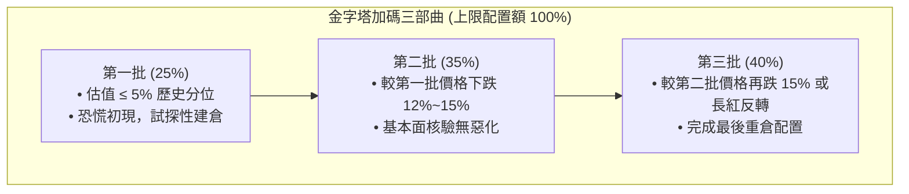

# 3.3 極端壓力環境：左側交易（Contrarian Value Accumulation）

> **理論分類**: 行為金融學與逆向投資理論 (Behavioral Finance & Contrarian Investing)  
> **核心概念**: 市場過度反應 (Market Overreaction)、均值回歸 (Mean Reversion)、金字塔分批加碼 (Pyramid DCA)  
> **關聯模組**: [`engine/regime.py`](file:///home/cosmo_chang/Projects/asymmetric-defensive-equity-guide/engine/regime.py)  
> **單元測試**: [`tests/test_engine.py`](file:///home/cosmo_chang/Projects/asymmetric-defensive-equity-guide/tests/test_engine.py)

---

## 理論支撐：De Bondt & Thaler (1985) 市場過度反應假設

Werner De Bondt 與 Richard Thaler 於 1985 年在 *The Journal of Finance* 發表了開創性的《Does the Stock Market Overreact?》。他們利用行為金融學實證發現：
- 受限於投資人的過度悲觀心理與流動性踩踏（Liquidity Cascades），極度受創的優質股票在經歷拋售或急性恐慌衝擊後，其價格會遠遠超跌於內在基本面價值；
- 在危機平息後，此類標的會展現顯著的「均值回歸（Mean Reversion）」特徵，為左側逆向投資人帶來巨額超額收益。

---

## 左側交易執行邏輯：極致品質與分批金字塔建倉

> [!CAUTION]
> **左側交易的致命風險**：  
> 若在空頭市場對普通股票或平庸企業盲目「逢低加碼（Averaging Down）」，常會面臨破產下市或價值陷阱。因此，本體系將左側建倉限制在極為嚴苛的邊界條件之內。

### 啟動門檻（Activation Gate）：
1. **宏觀恐慌狀態**：$\text{VIX} > 30$ 或大盤自高點急性回撤超過 15%（流動性枯竭期）；
2. **標的極致韌性**：標的之 Piotroski $F\text{-Score} \ge 8$ 且 Altman $Z\text{-Score} > 2.99$（資產負債表具備抵禦大蕭條級別衝擊的無風險防禦力）；
3. **估值跌入歷史極值分位**：標的之滾動本益比（P/E）或市現率（P/OCF）處於過去 10 年歷史序列的**前 5% 最低分位數（5th Percentile）**：
   $$\text{PercentileRank}(\text{Valuation}_t) \le 0.05$$

---

## 金字塔式分批加碼模型（Systematic Pyramid DCA）

嚴格禁止單次全額滿倉抄底，必須採用三次階梯式金字塔加碼法：

| 建倉批次 | 進場觸發條件 | 該批次資金配置比例（佔該標的總上限額） |
| :--- | :--- | :--- |
| **第一批（Initial Tranche）** | 估值跌入 5% 分位，恐慌初現 | 25% |
| **第二批（Secondary Tranche）** | 較第一批進場價格再下跌 12%~15%，且基本面無惡化 | 35% |
| **第三批（Final Tranche）** | 較第二批進場價格再下跌 15%，或出現首次長紅日K反轉 | 40% |

> [!WARNING]
> **熔斷中止機制**：  
> 若在任何批次執行過程中，公司之 $F\text{-Score}$ 跌破 7 或自由現金流轉負，立刻終止建倉並重新評估，絕不在基本面惡化時攤平。

---

## 🎯 本節核心要點 (Key Takeaways)

1. **左側抄底僅限極品**：必須滿足 $F\text{-Score} \ge 8$ 且 $Z\text{-Score} > 2.99$，杜絕任何破產風險。
2. **前 5% 估值極值**：僅在市場流動性錯殺至歷史極端區間時啟動，避免過早介入「接飛刀」。
3. **金字塔分批紀律**：以 25% / 35% / 40% 漸進加碼，保持充裕現金彈性，並設定基本面熔斷終止條件。

---

## 📚 相關文獻 (References)

- De Bondt, W. F., & Thaler, R. (1985). Does the stock market overreact? *The Journal of Finance*, 40(3), 793-805.

---
👉 **下一節**：閱讀 [3.4 雙向體制切換狀態機引擎與決策矩陣](04-state-machine-engine.md)
