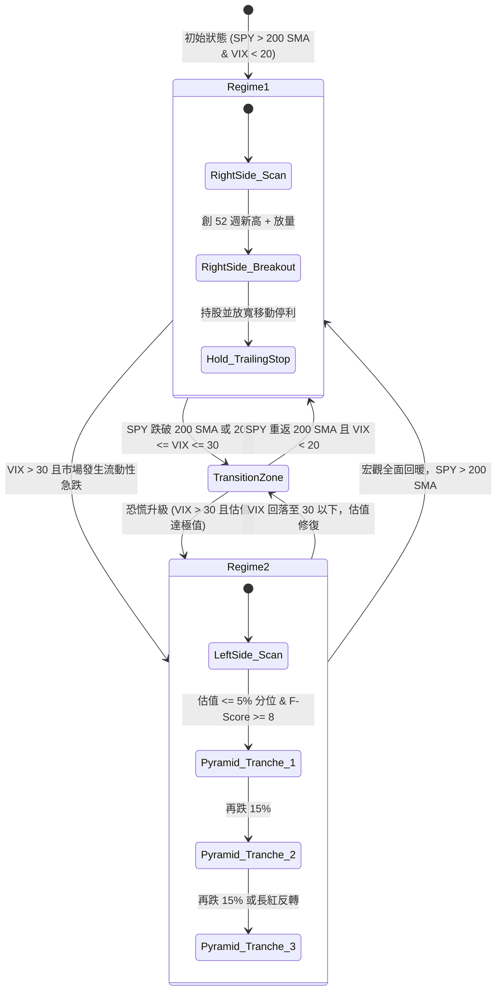

# 3.4 雙向體制切換狀態機引擎與決策矩陣

> **理論分類**: 有限狀態機與演算法交易 (Finite State Machines & Algorithmic Execution)  
> **核心概念**: 狀態機引擎 (FSM Engine)、體制決策矩陣、動態倉位分配  
> **關聯模組**: [`engine/regime.py`](file:///home/cosmo_chang/Projects/asymmetric-defensive-equity-guide/engine/regime.py)  
> **單元測試**: [`tests/test_engine.py`](file:///home/cosmo_chang/Projects/asymmetric-defensive-equity-guide/tests/test_engine.py)

---

## 體制切換狀態機狀態圖（State Transition Diagram）



---

## 體制切換引擎決策特徵矩陣

### 表 3-1: 體制切換引擎決策特徵矩陣（Regime Decision Matrix）

| 決策變數 / 行為 | 體制一：常態多頭（Regime 1） | 過渡觀望期（Transition） | 體制二：極端壓力（Regime 2） |
| :--- | :--- | :--- | :--- |
| **宏觀環境判定** | SPY > 200 SMA 且 VIX < 20 | SPY 震盪於 200 SMA 附近，20 $\le$ VIX $\le$ 30 | VIX > 30 或流動性踩踏 |
| **主導交易哲學** | **右側交易（動能突破）** | **防守防禦（收緊部位）** | **左側交易（極致價值積累）** |
| **標的准入門檻** | $F\text{-Score} \ge 7, \text{Sloan} \le 0.10$ | 僅維持現有優質持股 | $F\text{-Score} \ge 8, Z\text{-Score} > 2.99$ |
| **技術進場觸發** | 52 週新高或樞紐點放量突破 | 不主動新開倉 | 估值處於歷史前 5% 極端低位 |
| **倉位建立方式** | 一次性突破建倉（或回踩加碼） | 停止加倉，提高現金儲備 | 金字塔式分批加碼（25% / 35% / 40%） |
| **持股現金儲備** | 現金 0% ~ 15% | 現金 25% ~ 50% | 現金 15% ~ 35%（逐步釋放） |

---

## 體制切換演算法偽代碼（Algorithm 3.1）

```python
# 雙向體制切換狀態機核心邏輯
Function EvaluateMarketRegime(MacroData):
    spy_price = MacroData.SPY.Close[-1]
    spy_sma200 = MovingAverage(MacroData.SPY.Close, 200)[-1]
    vix = MacroData.VIX.Close[-1]
    
    If spy_price > spy_sma200 And vix < 22:
        Return "REGIME_1_NORMAL_BULL"
    ElseIf vix > 30:
        Return "REGIME_2_EXTREME_STRESS"
    Else:
        Return "REGIME_TRANSITION_NEUTRAL"

Function ExecuteRegimeStrategy(CurrentRegime, CandidateStocks):
    If CurrentRegime == "REGIME_1_NORMAL_BULL":
        # 執行右側動能策略
        For Each Stock In CandidateStocks.Approved_Regime1:
            is_breakout = Stock.Close[-1] >= Max(Stock.High[-252:])
            volume_confirmed = Stock.Volume[-1] >= 1.5 * Average(Stock.Volume[-50:])
            
            If is_breakout And volume_confirmed:
                CalculatePositionAndExecuteEntry(Stock, OrderType="RIGHT_SIDE_MOMENTUM")
                
    ElseIf CurrentRegime == "REGIME_2_EXTREME_STRESS":
        # 執行左側金字塔價值積累策略
        For Each Stock In CandidateStocks.Approved_Regime2:
            pe_historical_percentile = GetValuationPercentile(Stock.PE, history_years=10)
            
            If pe_historical_percentile <= 0.05:
                ExecutePyramidAccumulation(Stock, OrderType="LEFT_SIDE_CONTRARIAN")
                
    Else:
        # 過渡期：停止開倉，維持高現金流動性，嚴格執行防禦
        TightenRiskProtections()
```

---

## Python 引擎對應實作

在 [`engine/regime.py`](file:///home/cosmo_chang/Projects/asymmetric-defensive-equity-guide/engine/regime.py) 中，本狀態機透過列舉類別與驗證函式高效率運行：

```python
from engine.regime import (
    MarketRegime,
    identify_market_regime,
    validate_right_side_entry,
    validate_left_side_entry,
    calculate_pyramid_tranche
)

# 識別市場宏觀體制
regime = identify_market_regime(
    spy_price=510.0,
    spy_sma200=480.0,
    spy_sma200_slope_positive=True,
    vix=14.5
)
# 回傳: MarketRegime.REGIME_1_BULL
```

---

## 🎯 本節核心要點 (Key Takeaways)

1. **有限狀態機嚴格規範轉移**：杜絕在模糊震盪期主觀胡亂切換風格，規則全量化。
2. **現金比例動態調節**：多頭維持低現金、過渡期拉高現金至 50%、危機時階梯式釋放現金。
3. **右側與左側分立並行**：策略並非非黑即白，而是依據宏觀氣候切換至最適合的獲利土壤。

---

## 📚 相關文獻 (References)

- Schwert, G. W. (1989). Why does stock market volatility change over time? *The Journal of Finance*, 44(5), 1115-1153.
- Whaley, R. E. (2000). The investor fear gauge. *The Journal of Portfolio Management*, 26(3), 12-17.

---
👉 **章節總結**：第三章完畢，接下來進入 [第四章：非對稱風控系統——剛性停損與極限放寬停利](../04-risk-management/README.md)
