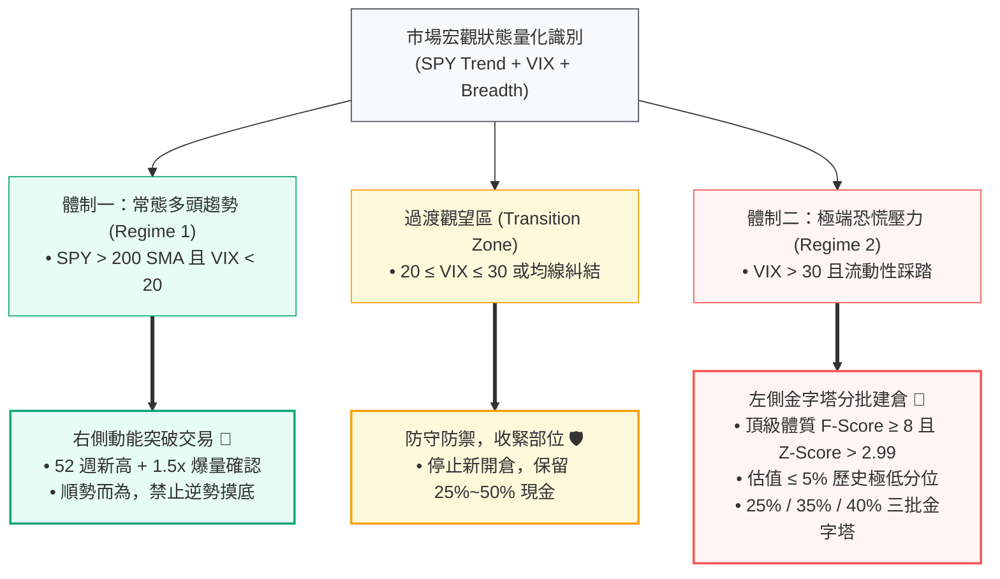

# 第三章：動態體制切換機制——雙向交易執行框架

> 「市場的本質並非靜態的隨機漫步，而是在平穩隨機動能態與極端恐慌均值回歸態之間交替切換的動態非線性系統。」  
> —— **Empirical Regime-Switching Theory**

---

## 📌 章節概覽與學習目標

金融市場具有非平穩性（Non-Stationary）。單一靜態策略（例如純動能或純深度價值）必然會遭遇難以忍受的回撤期：動能策略在市場流動性踩踏時會遭遇「動能崩潰（Momentum Crash）」，而逆勢價值策略在長期強勢趨勢中則容易過早賣出或在陰跌行情中過早耗盡資金。

為克服單一策略死角，本章設計一套**雙向體制切換引擎（Regime-Switching Engine）**，量化劃分市場宏觀環境，在不同體制下啟用完全不同的進場與資金配置模型。

### 🎯 核心學習目標
1. **建立多維宏觀體制識別指標**：整合標普 500 長線均線、CBOE VIX 隱含波動率分區與全市場寬度比率（Market Breadth）。
2. **精通右側動能突破執行模型**：依據 Jegadeesh & Titman (1993) 與 Moskowitz et al. (2012) 理論，掌握 52 週新高樞紐點與放量突破機制。
3. **建立極端壓力下左側金字塔建倉標準**：基於 De Bondt & Thaler (1985) 市場過度反應理論，掌握前 5% 歷史估值分位與 25%/35%/40% 階梯分批建倉模型。
4. **掌握狀態機引擎的狀態轉移**：理解並執行 [`engine/regime.py`](file:///home/cosmo_chang/Projects/asymmetric-defensive-equity-guide/engine/regime.py) 中的有限狀態機（FSM）。

---

## 🗺️ 雙向體制交易哲學對比

---

## 📑 子章節導覽

| 章節編號 | 單元名稱 | 核心論點與理論依據 | 對應 Python 代碼模組 |
| :--- | :--- | :--- | :--- |
| **[3.1](01-regime-identification-metrics.md)** | [市場宏觀狀態與趨勢體制識別](01-regime-identification-metrics.md) | SPY 200 SMA 趨勢狀態、CBOE VIX 隱含波動率分區與淨 52 週新高寬度比率 | [`engine/regime.py`](file:///home/cosmo_chang/Projects/asymmetric-defensive-equity-guide/engine/regime.py) |
| **[3.2](02-right-side-momentum-trading.md)** | [常態環境：右側動能突破交易](02-right-side-momentum-trading.md) | Jegadeesh & Titman (1993)、Moskowitz et al. (2012)；52 週新高突破與 1.5 倍成交量確認 | [`engine/regime.py`](file:///home/cosmo_chang/Projects/asymmetric-defensive-equity-guide/engine/regime.py) |
| **[3.3](03-left-side-contrarian-accumulation.md)** | [極端壓力環境：左側逆向價值積累](03-left-side-contrarian-accumulation.md) | De Bondt & Thaler (1985)；極致品質防護罩、5% 歷史估值分位與三批金字塔分批加碼法 | [`engine/regime.py`](file:///home/cosmo_chang/Projects/asymmetric-defensive-equity-guide/engine/regime.py) |
| **[3.4](04-state-machine-engine.md)** | [雙向體制切換狀態機引擎](04-state-machine-engine.md) | 有限狀態機（FSM）轉移圖、決策特徵矩陣與狀態機演算法偽代碼 | [`engine/regime.py`](file:///home/cosmo_chang/Projects/asymmetric-defensive-equity-guide/engine/regime.py) |

---
👉 **開始閱讀**：進入 [3.1 市場宏觀狀態與趨勢體制識別](01-regime-identification-metrics.md)
