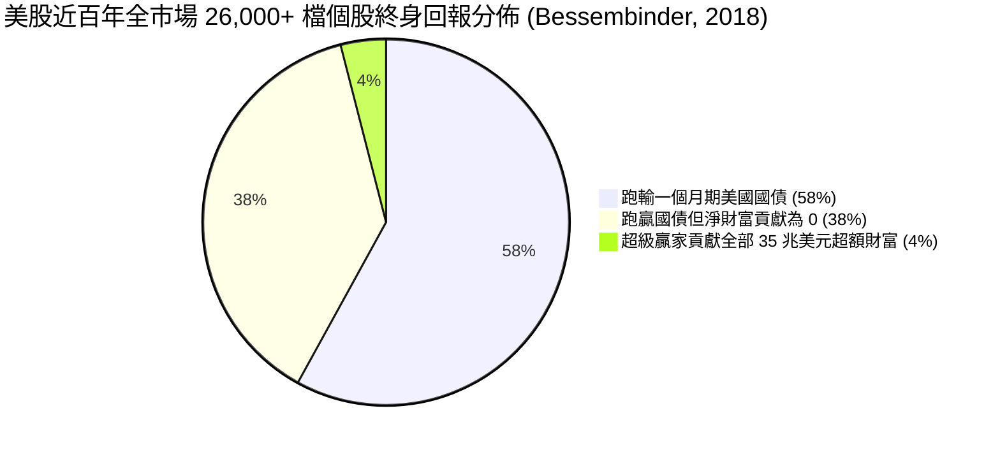

# 4.1 為什麼必須嚴格停損？實證與數學論證

> **理論分類**: 幾何機率論、行為金融學與實證金融 (Geometric Compounding, Behavioral Finance & Empirical Evidence)  
> **核心概念**: 幾何平均對稱性破缺、展望理論 (Prospect Theory)、處置效應 (Disposition Effect)、Bessembinder 4% 定理  
> **關聯模組**: [`engine/risk.py`](file:///home/cosmo_chang/Projects/asymmetric-defensive-equity-guide/engine/risk.py)  
> **單元測試**: [`tests/test_engine.py`](file:///home/cosmo_chang/Projects/asymmetric-defensive-equity-guide/tests/test_engine.py)

---

## 停損不是承認失敗，而是追求正偏態的數學前提

在投資界，「停損（Stop-Loss）」常被散戶誤認為是承認失敗的痛苦行為，甚至有人寄望於「只要不賣就不算賠」的心理防衛機制。

然而，在量化金融與實證資產定價的視角下，**剛性停損並非防禦手段，而是主動追求「正偏態肥尾回報」的數學先決條件**。

---

## 1. 幾何平均報酬率的對稱性破缺（Geometric Compounding Degradation）

資產組合的長期財富增長取決於回報率的幾何平均數（Geometric Mean），而非算術平均數（Arithmetic Mean）。當資產遭受虧損時，恢復初始本金所需的回報率呈現非線性的爆發式增長：

$$R_{\text{recovery}} = \frac{1}{1 - L} - 1 = \frac{L}{1 - L}$$

其中 $L \in (0, 1)$ 為虧損比例。

### 表 4-1: 虧損幅度與本金回原所需漲幅對照

| 虧損幅度 ($L$) | 恢復本金所需之淨報酬率 ($R_{\text{recovery}}$) | 數學衝擊與組合意涵 |
| :---: | :---: | :--- |
| **-5%** | **+5.26%** | 極易透過常態波動修復 |
| **-10%** | **+11.11%** | 正常的市場修正幅度 |
| **-20%** | **+25.00%** | 需要一個強勢季度的超額回報 |
| **-30%** | **+42.86%** | 需要顯著的大牛市驅動 |
| **-50%** | **+100.00%** | 必須資產翻倍，資本已遭受永久性毀滅性打擊 |
| **-75%** | **+300.00%** | 幾乎無法在常規週期內回本 |
| **-90%** | **+900.00%** | 數學上的統計死局（Statistical Ruin） |

一旦個股跌幅達到 50% 以上，投資人就將自身置於極度脆弱的數學劣勢中。這證明了：**控制單筆最大虧損在極小幅度內，是維繫複利引擎運轉的最高公理**。

---

## 2. 行為金融學視角：Kahneman & Tversky (1979) 展望理論與處置效應

Daniel Kahneman 與 Amos Tversky 於 1979 年在 *Econometrica* 提出的**展望理論（Prospect Theory）**指出了人類非理性決策的兩大特徵：
1. **S 型價值函數（S-Shaped Value Function）**：人們對虧損的敏感度遠大於獲利（損失厭惡係數 $\lambda \approx 2.25$ ）；
2. **獲利區風險厭惡，虧損區風險尋求**：在面對獲利時，投資人傾向落袋為安（凹函數，Concave）；而在面對虧損時，投資人為了避免兌現痛苦，反而轉變為「風險尋求者（Risk-Seeking）」，傾向死扛套牢甚至盲目攤平（凸函數，Convex）。

Shefrin & Statman (1985) 將此現象定義為**處置效應（Disposition Effect）**：
> 「投資人過早賣出賺錢的贏家股票（Riding Losers and Selling Winners），卻長期死抱虧損的輸家股票。」

這種心理偏誤直接摧毀了投資組合的幾何複利，將策略塑造成「勝率雖高但偶爾大暴賠」的**負偏態（Negative Skewness）**結構。本體系藉由預先設定的剛性停損演算法，將決策權完全移交給代碼，徹底排除處置效應的心理干擾。

---

## 3. 實證文獻：Bessembinder (2018)《Do Stocks Outperform Treasury Bills?》

Hendrik Bessembinder 於 2018 年發表於 *Journal of Financial Economics* 的重磅論文，分析了美國股市自 1926 年至 2016 年長達 90 年間的 26,000 多檔上市個股。

### Bessembinder 定理之核心啟示：
1. **極度右偏的分佈（Extreme Positive Skewness）**：美股個股回報分佈並非鐘形常態，而是極度右偏。
2. **大部分個股長期是平庸或毀滅財富的**：超過 58% 的美股在整個生命週期內的總回報率落後於 1 個月期美國國債；個股回報的中位數甚至為負。
3. **極少數超級贏家決定成敗**：整個美國股票市場自 1926 年以來產生的全部淨超額財富（Net Wealth Creation，約 35 萬億美元），**僅僅是由前 4% 的頂尖超級股票（如 Apple, Microsoft, ExxonMobil, Amazon 等）所貢獻**。

> [!CAUTION]
> **嚴格截斷的實證必然性**：  
> 由於你持有的任何一檔個股有超過 96% 的機率並不是那 4% 的超級贏家，**一旦個股價格結構轉弱並觸發停損，必須無條件立即斬斷！** 留著它只會讓平庸或走向衰亡的企業拖垮整體的資本淨值。反之，一旦有幸捕捉到那 4% 的超級贏家，必須極限放寬停利，讓複利乘數效應完全釋放。

---

## 🎯 本節核心要點 (Key Takeaways)

1. **虧損修復呈指數級暴增**：跌 10% 需漲 11% 回本，但跌 50% 需漲 100% 才能回本，絕不可任由虧損放大。
2. **克服人性處置效應**：人類天生愛賣贏家、死抱輸家，必須透過量化代碼剛性執行停損。
3. **96% vs 4% 的殘酷真相**：個股絕大多數長期平庸，必須無情淘汰錯誤標的，保護資本投入超級贏家。

---

## 📚 相關文獻 (References)

- Bessembinder, H. (2018). Do stocks outperform Treasury bills? *Journal of Financial Economics*, 129(3), 440-457.
- Kahneman, D., & Tversky, A. (1979). Prospect theory: An analysis of decision under risk. *Econometrica*, 47(2), 263-291.
- Shefrin, H., & Statman, M. (1985). The disposition to sell winners too early and ride losers too long: Theory and evidence. *The Journal of Finance*, 40(3), 777-790.

---
👉 **下一節**：閱讀 [4.2 剛性停損執行框架：Wilder ATR 吊燈停損與固定比例風險模型](02-rigid-stop-loss-framework.md)
