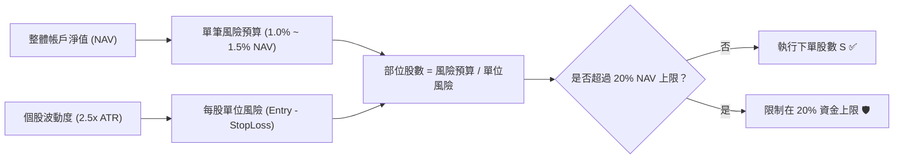

# 4.2 剛性停損執行框架（Rigid Stop-Loss Rules）

> **理論分類**: 波動率自適應風控與部位規模幾何學 (Volatility Adaptive Risk & Position Sizing)  
> **核心概念**: 平均真實波幅 (ATR)、吊燈停損法 (Chandelier Exit)、固定比例風險模型 (Fixed Fractional Risk)  
> **關聯模組**: [`engine/risk.py`](file:///home/cosmo_chang/Projects/asymmetric-defensive-equity-guide/engine/risk.py)  
> **單元測試**: [`tests/test_engine.py`](file:///home/cosmo_chang/Projects/asymmetric-defensive-equity-guide/tests/test_engine.py)

---

## 傳統固定比例停損之致命傷

傳統固定百分比停損（如「一律跌 5% 或 7% 停損」）忽略了不同標的與不同市場時期的波動率差異。一檔高 Beta 成長股的日常正常隨機雜訊可能就高達 4%，若設定 5% 停損將頻繁遭受「雜訊洗出場（Whipsaw）」；而對於低波動公用事業股，跌 5% 可能已代表重大的基本面破位。

因此，本體系採用 J. Welles Wilder (1978) 的**平均真實波幅（Average True Range, ATR）**進行波動度自適應校準。

---

## 1. 波動度調整停損：Wilder (1978) ATR 與吊燈停損法

### 真實波幅（True Range, TR）與 ATR 計算：

$$\text{TR}_t = \max\left( \text{High}_t - \text{Low}_t, \, \left|\text{High}_t - \text{Close}_{t-1}\right|, \, \left|\text{Low}_t - \text{Close}_{t-1}\right| \right)$$

$$\text{ATR}_{14}(t) = \frac{1}{14} \sum_{i=0}^{13} \text{TR}_{t-i}$$

### 初始剛性吊燈停損價位（Initial Chandelier Stop）：

$$\text{StopLoss}_{\text{initial}} = P_{\text{entry}} - K \times \text{ATR}_{14}(t_{\text{entry}})$$

在實務基準中，乘數取 $K = 2.5$ 。若 $2.5 \times \text{ATR}_{14}$ 的絕對跌幅超過進場價的 8%，則強制收緊至最大上限 8%（防止低波時期轉入極端暴跌時停損距離過寬）。

---

## 2. 組合單筆風險上限：固定比例風險模型（Fixed Fractional Risk Model）

Ralph Vince (1990) 指出，倉位管理的核心不在於單次買多少股，而在於**「這筆交易如果看錯停損，最多只允許損失整體組合 NAV 的多少百分比」**。這即是專業機構的 $R$ -風險模型（ $R\text{-Risk Model}$ ）。

### 數學公式：

設投資組合當前總淨值為 $\text{NAV}$ ，單筆交易允許承擔的最大風險比例為 $R \in [1.0\%, 1.5\%]$ ：

$$\text{Capital at Risk} = \text{NAV} \times R$$

$$\text{Unit Risk} = P_{\text{entry}} - \text{StopLoss}_{\text{initial}} = K \times \text{ATR}_{14}$$

因此，該標的的**買入股數（Position Shares）**與**部位名目價值（Position Value）**被嚴格鎖定為：

$$\text{Position Shares} (S) = \left\lfloor \frac{\text{NAV} \times R}{P_{\text{entry}} - \text{StopLoss}_{\text{initial}}} \right\rfloor$$

$$\text{Position Value} = S \times P_{\text{entry}} \le \text{Max Allocation Limit} \quad (\text{通常上限為 } 20\% \text{ NAV})$$

> [!WARNING]
> **倉位逆向調節鐵律**：  
> 當標的波動度劇烈（ $\text{ATR}$ 很大）時， $\text{Unit Risk}$ 變大，公式會**自動降低**可買入股數 $S$ ，從而限制總體風險暴露；當標的走勢平穩扎實（ $\text{ATR}$ 較小）時，系統才允許分配較大名目部位。這確保了組合中每一筆交易對整體 NAV 的衝擊力是嚴格等權重的。

---

## 🎯 本節核心要點 (Key Takeaways)

1. **ATR 自適應雜訊防護**：以 $2.5 \times \text{ATR}_{14}$ 為防禦緩衝，給予個股合理的呼吸空間，同時設定 8% 絕對最大上限。
2. **以風險定倉位，非以本金定倉位**：每筆交易虧損金額嚴格鎖死在總 NAV 的 1.0%~1.5%，連錯十次也不傷及核心元氣。
3. **逆波動度權重平衡**：高波動標的買少、低波動標的買多，使組合各持倉的下行風險貢獻度保持均衡。

---

## 📚 相關文獻 (References)

- Vince, R. (1990). *Portfolio Management Formulas: Mathematical Trading Methods for the Futures, Options, and Stock Markets*. John Wiley & Sons.
- Wilder, J. W. (1978). *New Concepts in Technical Trading Systems*. Trend Research.

---
👉 **下一節**：閱讀 [4.3 放寬停利與長期持有：正偏態肥尾捕捉與多層次移動停利](03-trailing-stop-and-fat-tail-capture.md)
