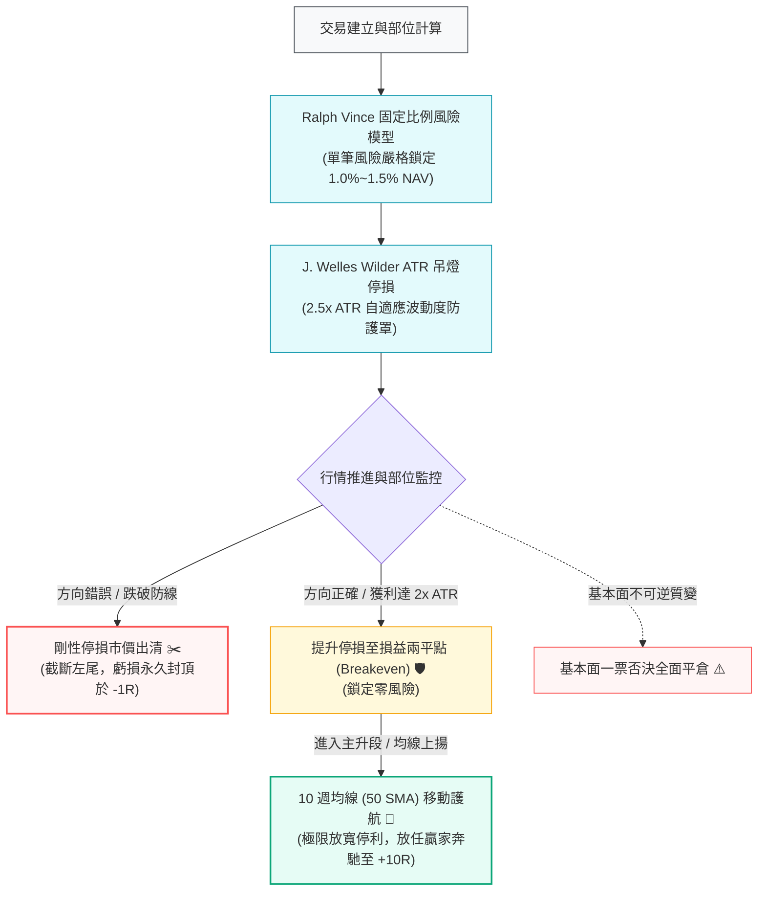

# 第四章：非對稱風控系統——剛性停損與極限放寬停利

> 「如果你不能在虧損很小的時候將它截斷，遲早你將面對一個足以終結你職業生涯的巨大黑天鵝。」  
> —— **Professional Risk Management Axiom**

---

## 📌 章節概覽與學習目標

在投資領域，多數投資人將失敗歸咎於「選股不準」，但實證金融學證明：**投資組合的長期幾何回報，絕大部分由「部位規模管理」與「非對稱離場機制」決定**。

本章將從幾何複利損耗數學、展望理論（Prospect Theory）的心理偏誤，以及 Bessembinder (2018) 美股近百年歷史全市場個股回報分佈出發，論證「嚴格剛性停損」與「極限放寬停利」的必然性，並建立工業級的 ATR 自適應部位模型與全生命週期風控系統。

### 🎯 核心學習目標
1. **理解幾何平均回報的對稱性破缺**：推導虧損修復的指數級難度，論證資本保全公理。
2. **根除處置效應（Disposition Effect）**：剖析展望理論中的損失厭惡與虧損區風險尋求心理，以代碼強制執行決策。
3. **領悟 Bessembinder 4% 超級贏家定理**：理解為何美股跨期全部淨超額財富僅由 4% 股票貢獻，領悟「截斷 96% 平庸、擁抱 4% 傳奇」之真諦。
4. **精通自適應部位與移動停利體系**：掌握 Wilder (1978) ATR 吊燈停損、Ralph Vince 固定比例風險模型（$R$-Risk），以及四階段移動停利機制。

---

## 🗺️ 非對稱風控全流程地圖

---

## 📑 子章節導覽

| 章節編號 | 單元名稱 | 核心論點與理論依據 | 對應 Python 代碼模組 |
| :--- | :--- | :--- | :--- |
| **[4.1](01-empirical-case-for-stop-loss.md)** | [為什麼必須嚴格停損？](01-empirical-case-for-stop-loss.md) | 幾何複利損耗推導、Kahneman-Tversky (1979) 展望理論、Bessembinder (2018) 4% 超級贏家定理 | [`engine/risk.py`](file:///home/cosmo_chang/Projects/asymmetric-defensive-equity-guide/engine/risk.py) |
| **[4.2](02-rigid-stop-loss-framework.md)** | [剛性停損執行框架](02-rigid-stop-loss-framework.md) | Wilder (1978) ATR 吊燈停損、Ralph Vince (1990) 固定比例風險模型（$R$-Risk）與部位計算 | [`engine/risk.py`](file:///home/cosmo_chang/Projects/asymmetric-defensive-equity-guide/engine/risk.py) |
| **[4.3](03-trailing-stop-and-fat-tail-capture.md)** | [放寬停利與長期持有](03-trailing-stop-and-fat-tail-capture.md) | 正偏態肥尾捕捉機制、四階段動態移動停利與基本面質變一票否決機制 | [`engine/risk.py`](file:///home/cosmo_chang/Projects/asymmetric-defensive-equity-guide/engine/risk.py) |
| **[4.4](04-lifecycle-risk-matrix.md)** | [風控與部位管理全生命週期矩陣](04-lifecycle-risk-matrix.md) | 風控綜合決策矩陣、部位全生命週期演算法偽代碼與程式碼實現 | [`engine/risk.py`](file:///home/cosmo_chang/Projects/asymmetric-defensive-equity-guide/engine/risk.py) |

---
👉 **開始閱讀**：進入 [4.1 為什麼必須嚴格停損？實證與數學論證](01-empirical-case-for-stop-loss.md)
