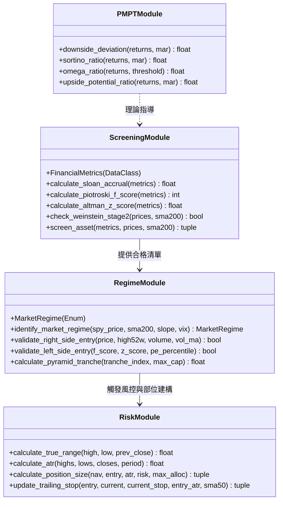

# 系統架構與代碼導覽

> **設計哲學**: SOLID 設計原則、型別安全（Type Safety）、無副作用純函式（Pure Functions）  
> **代碼根目錄**: [`engine/`](file:///home/cosmo_chang/Projects/asymmetric-defensive-equity-guide/engine/)  
> **單元測試目錄**: [`tests/test_engine.py`](file:///home/cosmo_chang/Projects/asymmetric-defensive-equity-guide/tests/test_engine.py)

---

## 模組分層架構概覽

引擎遵循單一職責原則（Single Responsibility Principle, SRP），將四大理論支柱嚴密映射至四個獨立的高內聚模組：

---

## 四大核心模組詳細剖析

### 1. 後現代投資組合理論模組：[`engine/pmpt.py`](file:///home/cosmo_chang/Projects/asymmetric-defensive-equity-guide/engine/pmpt.py)
專注於非對稱風險指標的計算：
- **`downside_deviation(returns, mar=0.0)`**：實作二階偏動差開方，嚴格以總樣本期數 $T$ 進行離散無偏估計。
- **`sortino_ratio(returns, mar=0.0)`**：以超額收益除以下行偏差；內建防禦性邊界檢查，當下行偏差為 0 且收益為正時安全回傳正無窮大 `float('inf')`。

### 2. 多維度選股篩選模組：[`engine/screening.py`](file:///home/cosmo_chang/Projects/asymmetric-defensive-equity-guide/engine/screening.py)
負責基本面與技術面的六層過濾：
- **`FinancialMetrics`**：強型別數據類別（dataclass），定義 Sloan 應計因子、Altman 5 項變數及 Piotroski 9 項財務指標。
- **`calculate_sloan_accrual()`**：計算應計利潤佔總資產比率，超標（$> 0.10$）一票否決。
- **`calculate_piotroski_f_score()`**：嚴格計算 0~9 分之評分。
- **`calculate_altman_z_score()`**：回傳精確 Z-Score 數值。
- **`check_weinstein_stage2()`**：檢驗股價高於 200 SMA 且均線斜率向上。
- **`screen_asset()`**：整合六層漏斗，同時輸出體制一（右側候選）與體制二（左側候選）合格標記。

### 3. 動態體制切換模組：[`engine/regime.py`](file:///home/cosmo_chang/Projects/asymmetric-defensive-equity-guide/engine/regime.py)
狀態機與雙向交易進場校驗：
- **`MarketRegime`**：列舉類別，定義 `REGIME_1_BULL`、`REGIME_TRANSITION_NEUTRAL` 與 `REGIME_2_EXTREME_STRESS`。
- **`identify_market_regime()`**：依據 SPY 均線與 VIX 數值進行原子化狀態轉移。
- **`validate_right_side_entry()`**：驗證 52 週新高突破與 1.5 倍放量條件。
- **`validate_left_side_entry()`**：驗證 $F\text{-Score} \ge 8$、$Z\text{-Score} > 2.99$ 且估值處於前 5% 歷史分位。
- **`calculate_pyramid_tranche()`**：計算金字塔三批次（25% / 35% / 40%）的絕對配置金額。

### 4. 非對稱風控與部位模組：[`engine/risk.py`](file:///home/cosmo_chang/Projects/asymmetric-defensive-equity-guide/engine/risk.py)
資本保全與利潤奔馳引擎：
- **`calculate_atr()`**：14 日 Wilder 平均真實波幅計算。
- **`calculate_position_size()`**：實作固定比例風險模型，以單筆最大損失額除以 $2.5 \times \text{ATR}$ 計算股數，並施加 20% NAV 集中度天花板。
- **`update_trailing_stop()`**：四階段動態移動停利推進演算法。

---

## 🎯 本節核心要點 (Key Takeaways)

1. **嚴格無魔法數字**：所有門檻（如 0.10 Sloan、1.81 Z-Score、2.5 ATR、1.25% 風險比例）皆定義為具備語意說明的常數或函式預設參數。
2. **完全可測性**：無外部網絡或資料庫副作用，所有模組均可透過標準 NumPy/Python 原生數據結構快速執行單元測試。
3. **介面職責高內聚**：選股只管篩選、體制只管宏觀狀態、風控只管部位與停損，各司其職。

---
👉 **下一單元**：閱讀 [5.3 實戰示範：端到端量化管線演練](03-e2e-pipeline-walkthrough.md)
