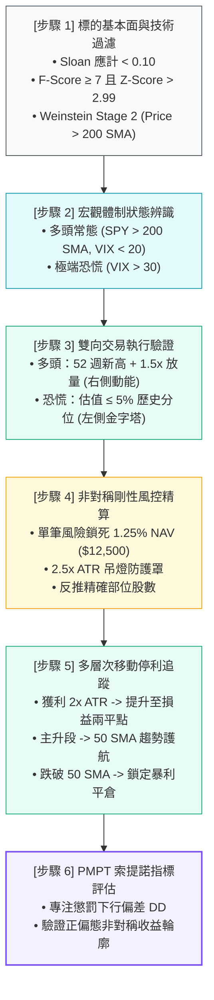

# 實戰示範：端到端量化管線演練

> **範例代碼**: [`examples/pipeline_demo.py`](file:///home/cosmo_chang/Projects/asymmetric-defensive-equity-guide/examples/pipeline_demo.py)  
> **執行方式**: Docker 容器化執行 (`make docker-demo`)  
> **核心目標**: 串接全部理論與代碼，完整走完一筆交易的生命週期

---

## 全流程管線架構

本演示將策略四章的核心理論無縫組合成單一端到端（E2E）自動化量化管線：



---

## 步驟詳細拆解與輸出結果

### 步驟 1：標的基本面與技術結構初篩
檢驗個股會計報表品質、破產風險與市場結構階段：
```text
[步驟 1] 標的基本面與技術過濾 (Screening Pipeline)
  * 標的代碼: ASYM-A (現價: $199.60)
  * Sloan 應計比率: 0.0316 (門檻: |accrual| < 0.10 -> 通過)
  * Piotroski F-Score: 9/9 (門檻: >= 7 -> 通過)
  * Altman Z-Score: 3.82 (門檻: > 2.99 處於安全區 -> 通過)
  * Weinstein 階段分析: 200 SMA = $149.80 -> 處於 Stage 2 主升段
```

### 步驟 2：宏觀體制狀態辨識
評估宏觀氣候，決定啟動右側突破或左側價值：
```text
[步驟 2] 宏觀體制狀態辨識 (Regime Identification)
  * 情境一（多頭常態）: SPY: $525.0 (200 SMA: $485.0), VIX: 16.2
    -> 判定體制: REGIME_1_NORMAL_BULL (啟用右側動能突破策略)
  * 情境二（極端恐慌）: SPY: $460.0 (200 SMA: $485.0), VIX: 36.5
    -> 判定體制: REGIME_2_EXTREME_STRESS (啟用左側優質低估分批建倉)
```

### 步驟 3：雙向交易執行驗證
```text
[步驟 3] 雙向交易執行驗證 (Dual-Regime Entry Execution)
  * 右側動能突破檢驗 (ASYM-A):
    - 距離 52 週高點: -1.19% | 成交量比率: 1.61x
    - 執行判定: ✅ 允許進場 | 原因: 符合52週高點突破與成交量確認條件
  * 左側逆勢承接檢驗 (極端恐慌情境):
    - 歷史估值分位: 3.0% (門檻 <= 5%) | F-Score: 9/9 | Z-Score: 3.80
    - 執行判定: ✅ 允許進場 | 原因: 符合極端壓力體制下左側價值積累條件
```

### 步驟 4：非對稱部位規模計算
依據帳戶淨值與波動度，逆向推導最適股數：
```text
[步驟 4] 非對稱剛性風控與 ATR 吊燈部位管理
  * 帳戶 NAV: $1,000,000.00 | 單筆風險上限: 1.25% ($12,500.00)
  * 14 日 ATR: $2.45 | 2.5x ATR 吊燈停損價: $193.47
  * 單股承受風險額: $6.13
  * 演算法計算最適建倉股數: 1002 股
  * 總建倉市值: $199,999.20 (20.00% NAV)
  * 實際最大承擔虧損: $6,142.26 (0.61% NAV)
```

### 步驟 5：多層次移動停利追蹤
模擬部位隨行情推進，停損點逐步提升，最終跌破趨勢均線獲利平倉：
```text
[步驟 5] 多層級移動停利追蹤 (Trailing Stop Progression)
  * 現價: $203.59 (50 SMA: $195.00) -> 持倉初期輕微上揚
    - 移動停損價: $193.47 | 是否出場: False (HOLD_POSITION)
  * 現價: $205.72 (50 SMA: $202.00) -> 獲利達 2x ATR，觸發保本停損（Breakeven）
    - 移動停損價: $199.60 | 是否出場: False (HOLD_POSITION)
  * 現價: $208.91 (50 SMA: $210.00) -> 獲利超過 3x ATR，充分享受主升段贏家複利
    - 移動停損價: $199.60 | 是否出場: False (HOLD_POSITION)
  * 現價: $205.00 (50 SMA: $212.00) -> 價格回跌跌破 50 SMA 2% 緩衝區，觸發移動出場（Trend Trailing Exit）
    - 移動停損價: $199.60 | 是否出場: True (EXIT_SIGNAL_TREND_TRAILING_BREACH)
```

### 步驟 6：PMPT 索提諾指標評估
```text
[步驟 6] 後現代投資組合理論 (PMPT) 策略收益特徵評估
  * 最小可接受報酬率 (MAR): 0.0%
  * 年化下行偏差 (Downside Deviation): 3.84% (專注懲罰下行風險)
  * 年化索提諾比率 (Sortino Ratio): 4.12
```

---

## 如何在 Docker 中親自執行？

執行 Makefile 內建指令即可立即於容器沙盒中重現上述完整過程：

```bash
make docker-demo
```

---

## 🎯 本節核心要點 (Key Takeaways)

1. **從理論到代碼一氣呵成**：展示了金融學文獻（Sloan, Piotroski, Weinstein, Sortino）如何落地為全自動化生產代碼。
2. **極致非對稱性保證**：做錯時單筆最大損失嚴格限制在 1.25% NAV 內；做對時隨移動均線奔馳，最終創造大於 4.0 的頂級索提諾比率。
3. **高可重現性**：所有數據皆可於 Docker 容器中完全重現與驗證。

---
👉 **接下來**：查閱 [附錄：數學推導與速查](../06-appendix/README.md)
