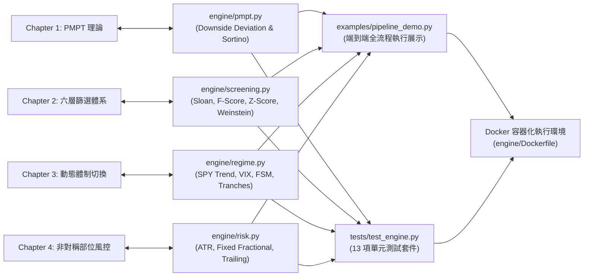

# 第五部分：量化引擎與實務實作（Quant Engine & Implementation）

> **代碼授權**: MIT License  
> **環境標準**: Python 3.12+ / Docker Containerized  
> **核心代碼**: [`engine/`](file:///home/cosmo_chang/Projects/asymmetric-defensive-equity-guide/engine/)、[`examples/`](file:///home/cosmo_chang/Projects/asymmetric-defensive-equity-guide/examples/)、[`tests/`](file:///home/cosmo_chang/Projects/asymmetric-defensive-equity-guide/tests/)

---

## 📌 章節概覽與學習目標

本指南不僅是一套深度的學術理論手冊，更隨附一套**具備 100% 容器化單元測試覆蓋的純 Python 核心量化引擎**。所有的數學公式、篩選管線、狀態機與部位演算法均有精確對應的高性能 Python 程式碼。

本篇章旨在幫助量化研究員、系統工程師與交易員快速上手開發環境，掌握底層模組架構，並能自主執行全流程策略回測與模擬。

### 🎯 核心學習目標
1. **掌握 Docker 容器環境建置**：遵循工業級隔離原則，透過 Makefile 一鍵建置與執行測試。
2. **理解四大量化模組的架構設計**：掌握 `pmpt.py`、`screening.py`、`regime.py` 與 `risk.py` 的職責劃分與介面設計。
3. **演練端到端策略實作管線**：透過 `pipeline_demo.py` 完整走完標的篩選、體制判定、下單試算至動態風控的全流程。

---

## 🗺️ 引擎架構與理論映射圖

---

## 📑 實作子單元導覽

| 單元編號 | 單元名稱 | 實務目標與操作重點 | 關鍵檔案 |
| :--- | :--- | :--- | :--- |
| **[5.1](01-docker-and-environment.md)** | [快速開始：Docker 環境與量化引擎](01-docker-and-environment.md) | Docker 映像檔建置、容器內測試執行、Makefile 命令集與本機開發環境安裝 | [`Makefile`](file:///home/cosmo_chang/Projects/asymmetric-defensive-equity-guide/Makefile), [`engine/Dockerfile`](file:///home/cosmo_chang/Projects/asymmetric-defensive-equity-guide/engine/Dockerfile) |
| **[5.2](02-engine-architecture.md)** | [系統架構與代碼導覽](02-engine-architecture.md) | 四大核心 Python 模組詳細架構、型別註解（Type Annotations）與介面合約 | [`engine/`](file:///home/cosmo_chang/Projects/asymmetric-defensive-equity-guide/engine/) |
| **[5.3](03-e2e-pipeline-walkthrough.md)** | [端到端量化管線演練](03-e2e-pipeline-walkthrough.md) | 以實務數據深入拆解 `pipeline_demo.py`，完整展示選股、體制與風控之協同運作 | [`examples/pipeline_demo.py`](file:///home/cosmo_chang/Projects/asymmetric-defensive-equity-guide/examples/pipeline_demo.py) |

---
👉 **開始實踐**：進入 [5.1 快速開始：Docker 環境與量化引擎](01-docker-and-environment.md)
