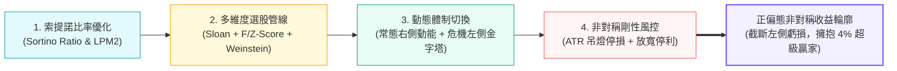

# 非對稱防禦型美股策略指南：索提諾比率優化與雙向體制交易框架

> **理論框架**: 後現代投資組合理論（PMPT）與實證資產定價（Empirical Asset Pricing）  
> **目標受眾**: 專業投資機構經理人、量化交易員、高階個人投資者  
> **聲明**: 本專案為使用 AI 撰寫之量化交易與資產配置學習教材，僅供學術交流與程式開發研究使用，不構成任何投資建議。  
> **生成與授權宣告**: 本作品全部由 AI 生成，本作品採用 創用 CC 姓名標示-非商業性 4.0 國際授權條款 (CC BY-NC 4.0) 與 MIT 授權條款釋出。

---

## 📖 全書概覽與核心主旨

在現代金融市場中，傳統均值-變異數理論（Markowitz Mean-Variance Optimization, 1952）長期佔據資產配置的核心教科書地位。然而，該理論建立於「資產報酬率服從對稱高斯常態分佈」的理想化假設之上，將**向上賺錢的波動（Upside Volatility）**與**向下虧損的波動（Downside Volatility）**等同視為風險予以懲罰。這種數學對稱性在真實市場中被證明存在根本性缺陷——金融時間序列普遍存在顯著的肥尾效應（Fat Tails, Mandelbrot, 1963）與負偏態（Negative Skewness）。

本書《非對稱防禦型美股策略指南：索提諾比率優化與雙向體制交易框架》旨在徹底跳脫對稱風險懲罰的思維桎梏，全面轉向以**後現代投資組合理論（Post-Modern Portfolio Theory, PMPT）**為核心基石的交易與配置體系。



---

## 🏛️ 全書核心四大支柱

1. **索提諾比率（Sortino Ratio）目標函數優化**：  
   定義最小可接受報酬率（$MAR$），專注極小化下行偏差（Downside Deviation, $DD$），構建具備「右偏肥尾」特徵的非對稱收益輪廓。
2. **基本面因子初篩與技術結構過濾**：  
   融合 Sloan (1996) 應計利潤異象、Piotroski (2000) $F\text{-Score}$ 財務體質模型、Altman (1968) $Z\text{-Score}$ 破產風險過濾，結合 Fama-French 五因子高 ROIC 與持續正向自由現金流（FCF Yield），並以 Stan Weinstein 階段分析與 200 SMA 鎖定主升段標的。
3. **雙向體制切換引擎（Regime-Switching Engine）**：  
   量化劃分市場宏觀狀態。於常態多頭環境中實施嚴格的**右側動能突破交易（Right-Side Momentum）**；於極端恐慌與流動性衝擊時，針對基本面無懈可擊（$F\text{-Score} \ge 8$）且估值跌入歷史極低分位的標的，啟動系統化**左側金字塔分批建倉（Left-Side Value Accumulation）**。
4. **非對稱剛性風控與放寬停利（Asymmetric Risk Management）**：  
   立足於 Bessembinder (2018) 的跨世紀實證結論——美股跨期全部淨超額財富僅由前 4% 的極少數超級贏家驅動。個股看錯必須透過 ATR 吊燈停損（Chandelier Exit）與固定比例風險模型（Fixed Fractional Risk）將單筆 NAV 虧損嚴格截斷於 1%~1.5%；看對時則極限放寬停利，以移動均線與基本面質變為離場條件，充分享受贏家複利。

---

## 🧭 推薦閱讀路徑

- **理論研究者**：建議由 [第一章：後現代投資組合理論與索提諾比率](01-core-philosophy/README.md) 起步，深入研讀 [附錄 A：下行偏差與偏動差嚴格數學推導](06-appendix/01-mathematical-foundations.md)。
- **策略開發者**：可先快速閱讀 [快速開始：Docker 環境與量化引擎](05-engine-and-quickstart/01-docker-and-environment.md) 與 [系統架構與代碼導覽](05-engine-and-quickstart/02-engine-architecture.md)，再比對 [第二章標的篩選](02-asset-selection/README.md) 與 [第四章部位風控](04-risk-management/README.md) 的實作邏輯。
- **實盤交易員**：重點參閱 [第三章雙向體制切換執行](03-regime-switching/README.md)、[第四章移動停利規則表](04-risk-management/03-trailing-stop-and-fat-tail-capture.md) 與 [附錄 B：全系統量化參數速查表](06-appendix/02-parameter-cheat-sheet.md)。

---

## 💻 容器化量化引擎（Docker Engine）

本書隨附一套經 Docker 容器化驗證的純 Python 核心量化引擎代碼庫（`engine/`），讀者可於完全隔離的沙盒環境中執行各項演算法與測試驗證：

```bash
# 建置 Docker 映像檔並執行全部 13 項單元測試
make docker-test

# 執行端到端完整策略管線演示
make docker-demo
```

---

## 📄 授權條款 (License)

> 本作品內容由 AI 輔助全面生成，並由專案發起人進行架構設計與彙整發布。本作品採用 創用 CC 姓名標示-非商業性 4.0 國際授權條款 (CC BY-NC 4.0) 與 MIT 授權條款釋出。

本書採用**雙授權（Dual-Licensing）模式**：
- **電子書與教學內容**：位於 [`docs/`](./) 中之全書章節、數學推導與策略教學手冊，採用 [CC BY-NC 4.0](https://creativecommons.org/licenses/by-nc/4.0/deed.zh-hant)（創用 CC 姓名標示-非商業性 4.0 國際授權條款）釋出。歡迎自由閱讀、分享與非商業改作，但**未經原作者書面授權，嚴禁任何形式之商業營利、付費轉載或集結出版**。
- **範例代碼、量化引擎與配置**：位於 [`engine/`](../engine/)、[`tests/`](../tests/) 與 [`examples/`](../examples/) 中之程式碼及設定檔，均採用寬鬆的 [MIT License](../LICENSE) 授權，讀者可自由在個人或企業內部專案中無痛引用與部署。

### ⚠️ 免責與商標聲明
- **投資與技術免責**：本手冊所載之量化模型、因子回測、體制切換演算法與部位管理代碼範例僅供學習參考與學術研究，投入實盤交易或生產環境前請務必於沙盒環境充分測試。作者與貢獻者不承擔任何直接或間接之投資損益或營運業務損失責任。
- **商標與引用聲明**：文中所提及之指數標的（如 `SPY`、`VIX`）及金融學術模型（如 Markowitz、Sortino、Piotroski、Altman 等），其商標、商號或學術智慧財產權均屬原持有人或機構所有。本書為獨立研發之開源學習手冊，非任何金融機構或交易所官方贊助、附屬或背書之專案。

### 📖 引用本手冊 (Citation)
若您在文章、教材或專案中引用本書內容，請依 CC 規範標註出處：
> Cosmo Chang, *非對稱防禦型美股策略指南：索提諾比率優化與雙向體制交易框架*, 2026. GitHub: https://github.com/cosmo-chang-1701/asymmetric-defensive-equity-guide

---
👉 **開始閱讀**：[快速開始：Docker 環境與量化引擎](05-engine-and-quickstart/01-docker-and-environment.md) 或 [第一章：後現代投資組合理論與索提諾比率](01-core-philosophy/README.md)
