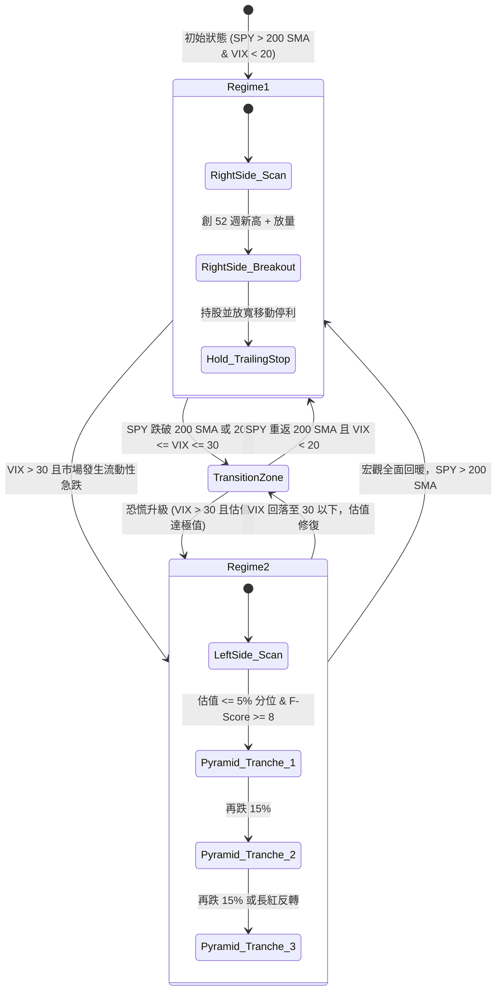

# 第三章：動態體制切換機制——雙向交易執行框架

> 「市場的本質並非靜態的隨機漫步，而是在平穩隨機動能態與極端恐慌均值回歸態之間交替切換的動態非線性系統。」  
> —— Empirical Regime-Switching Theory

---

## 3.1 市場宏觀狀態與趨勢體制識別（Regime Identification）

金融市場不具備平穩性（Non-Stationary）。一個單一靜態策略（例如純動能或純深度價值）必然會經歷長期難以承受的回撤期：動能策略在市場流動性踩踏或反轉崩盤時會遭遇劇烈的「動能崩潰（Momentum Crash）」，而逆勢價值策略在長期強勢趨勢中則過早賣出或在陰跌行情中過早耗盡子彈。

為克服單一策略的死角，本架構引入**雙向體制切換引擎（Regime-Switching Engine）**，將市場量化拆解為三大狀態：
1. **體制一：常態/多頭趨勢環境（Regime 1: Normal / Bull Trend）**；
2. **過渡/中性觀望環境（Transition / Neutral Zone）**；
3. **體制二：極端壓力/恐慌環境（Regime 2: Crisis / Extreme Stress）**。

### 宏觀與微觀結構量化指標體系

#### 1. 基準指數長期趨勢（Benchmark Trend）
以標普 500 指數（S&P 500 ETF: SPY）作為市場錨點：

$$\text{Regime}_{\text{Trend}} = \begin{cases} 
\text{Bullish (1)}, & \text{if } P_{\text{SPY}, t} > \text{SMA}_{200}(t) \text{ and } \text{SMA}_{200}(t) \ge \text{SMA}_{200}(t-10) \\
\text{Bearish (0)}, & \text{otherwise}
\end{cases}$$

#### 2. CBOE 波動率指數隱含狀態（VIX Volatility Regime）
芝加哥期權交易所波動率指數（VIX）代表標普 500 期權的 30 天隱含波動率，被廣泛視為市場的「恐慌指標」：
- **低波常態區（Low-Vol Stability）**：$\text{VIX} < 20$
- **過渡震盪區（Elevated Volatility）**：$20 \le \text{VIX} \le 30$
- **極端恐慌區（Crisis Stress / Liquidity Shock）**：$\text{VIX} > 30$（若 $\text{VIX} > 40$，標誌歷史級別踩踏）

#### 3. 美股市場寬度（Market Breadth）
以全市場或標普 500 成分股的淨 52 週新高指標（Net New Highs - Net New Lows, NNH-NNL）作為內生結構動能的深度量度：

$$\text{Breadth Ratio} = \frac{\sum_{i=1}^M \mathbb{I}(P_{i,t} \ge \text{High}_{52W, i})}{\sum_{i=1}^M \mathbb{I}(P_{i,t} \le \text{Low}_{52W, i}) + \epsilon}$$

當 $\text{Breadth Ratio} > 2.0$ 時代表廣度極為健康；當 $\text{Breadth Ratio} < 0.2$ 且創 52 週新低家數爆發時，代表市場進入全面去槓桿期。

---

## 3.2 常態環境：右側交易（Momentum & Trend Following）

### 1. 理論支撐：橫斷面動能與時間序列動能

在常態多頭體制中，市場價格反映資訊具有持續的延遲擴散效應（Information Diffusion Delay），動能效應展現高度穩健的風險溢價：
- **Jegadeesh & Titman (1993)** 在發表於 *The Journal of Finance* 的經典文獻《Returns to Buying Winners and Selling Losers: Implications for Stock Market Efficiency》中證明：過去 3 至 12 個月表現最佳的股票組合（Winners），在隨後的 3 至 12 個月內持續以統計顯著的幅度跑贏落後組合（Losers）。
- **Moskowitz, Ooi, & Pedersen (2012)** 於 *Journal of Financial Economics* 進一步確立了「時間序列動能（Time Series Momentum, TSMOM / Trend Following）」在跨資產類別中的普遍有效性，確認資產自身歷史收益具備顯著的自相關性。

### 2. 右側交易執行邏輯

在 Regime 1 中，策略嚴格奉行**「右側突破、順應趨勢」**的交易哲學，禁止主觀逆勢摸底：

#### 入場條件（Entry Signals）：
1. **標的池歸屬**：標的已通過第二章之基本面高質量初篩（$F\text{-Score} \ge 7, \text{Sloan Ratio} \le 0.10, \text{ROIC} \ge 15\%$）；
2. **基底突破（Pivot Point Breakout）**：價格突破長達數週（至少 6 至 8 週）之整固基底（Base Pattern）之高點阻力位，或創下 52 週新高（52-Week High Breakout）：
   $$P_t > \max(P_{t-1}, P_{t-2}, \dots, P_{t-252})$$
3. **成交量放量確認（Volume Confirmation）**：突破當日成交量必須放大至 50 日均量（50-day Volume MA）的 1.5 倍以上：
   $$\text{Volume}_t \ge 1.5 \times \text{VolMA}_{50}(t)$$
4. **絕對禁止行為**：股價位於 200 日均線下方時，一律不予建倉。

> [!NOTE]
> **右側交易的優勢**：  
> 右側交易不試圖猜測行情的最低點，而是等待市場資金形成共識、突破結構阻力後順流而入。雖然犧牲了底部至突破點的初期價差，但大幅降低了沉沒時間成本與無休止盤跌的下行風險。

---

## 3.3 極端壓力環境：左側交易（Contrarian Value Accumulation）

### 1. 理論支撐：De Bondt & Thaler (1985) 市場過度反應假設

Werner De Bondt 與 Richard Thaler 於 1985 年在 *The Journal of Finance* 發表了開創性的《Does the Stock Market Overreact?》。他們利用行為金融學實證發現：
- 受限於投資人的過度悲觀心理與流動性踩踏（Liquidity Cascades），極度受創的優質股票在經歷 3 至 5 年的拋售或急性恐慌衝擊後，其價格會遠遠超跌於內在基本面價值；
- 在危機平息後，此類標的會展現顯著的「均值回歸（Mean Reversion）」特徵，為左側逆向投資人帶來巨額超額收益。

### 2. 左側交易執行邏輯：極致品質與分批金字塔建倉

> [!CAUTION]
> **左側交易的致命風險**：  
> 若在空頭市場對普通股票或平庸企業盲目「逢低加碼（Averaging Down）」，常會面臨破產下市或價值陷阱。因此，本體系將左側建倉限制在極為嚴苛的邊界條件之內。

#### 啟動門檻（Activation Gate）：
1. **宏觀恐慌狀態**：$\text{VIX} > 30$ 或大盤自高點急性回撤超過 15%（流動性枯竭期）；
2. **標的極致韌性**：標的之 Piotroski $F\text{-Score} \ge 8$ 且 Altman $Z\text{-Score} > 2.99$（資產負債表具備抵禦大蕭條級別衝擊的無風險防禦力）；
3. **估值跌入歷史極值分位**：標的之滾動本益比（P/E）或市現率（P/OCF）處於過去 10 年歷史序列的**前 5% 最低分位數（5th Percentile）**：
   $$\text{PercentileRank}(\text{Valuation}_t) \le 0.05$$

#### 金字塔式分批加碼模型（Systematic Pyramid DCA）：
嚴格禁止單次全額滿倉抄底，必須採用三次階梯式金字塔加碼法：

| 建倉批次 | 進場觸發條件 | 該批次資金配置比例（佔該標的總上限額） |
| :--- | :--- | :--- |
| **第一批（Initial Tranche）** | 估值跌入 5% 分位，恐慌初現 | 25% |
| **第二批（Secondary Tranche）** | 較第一批進場價格再下跌 12%~15%，且基本面無惡化 | 35% |
| **第三批（Final Tranche）** | 較第二批進場價格再下跌 15%，或出現首次長紅日K反轉 | 40% |

若在任何批次執行過程中，公司之 $F\text{-Score}$ 跌破 7 或自由現金流轉負，立刻終止建倉並重新評估。

---

## 3.4 雙向體制切換狀態機引擎與執行偽代碼

### 體制切換狀態機狀態圖（State Transition Diagram）



---

### 表 3-1: 體制切換引擎決策特徵矩陣（Regime Decision Matrix）

| 決策變數 / 行為 | 體制一：常態多頭（Regime 1） | 過渡觀望期（Transition） | 體制二：極端壓力（Regime 2） |
| :--- | :--- | :--- | :--- |
| **宏觀環境判定** | SPY > 200 SMA 且 VIX < 20 | SPY 震盪於 200 SMA 附近，20 $\le$ VIX $\le$ 30 | VIX > 30 或流動性踩踏 |
| **主導交易哲學** | **右側交易（動能突破）** | **防守防禦（收緊部位）** | **左側交易（極致價值積累）** |
| **標的准入門檻** | $F\text{-Score} \ge 7, \text{Sloan} \le 0.10$ | 僅維持現有優質持股 | $F\text{-Score} \ge 8, Z\text{-Score} > 2.99$ |
| **技術進場觸發** | 52 週新高或樞紐點放量突破 | 不主動新開倉 | 估值處於歷史前 5% 極端低位 |
| **倉位建立方式** | 一次性突破建倉（或回踩加碼） | 停止加倉，提高現金儲備 | 金字塔式分批加碼（25% / 35% / 40%） |
| **持股現金儲備** | 現金 0% ~ 15% | 現金 25% ~ 50% | 現金 15% ~ 35%（逐步釋放） |

---

### 體制切換演算法偽代碼（Algorithm 3.1: Regime-Switching Engine）

```python
# 雙向體制切換狀態機核心邏輯
Function EvaluateMarketRegime(MacroData):
    spy_price = MacroData.SPY.Close[-1]
    spy_sma200 = MovingAverage(MacroData.SPY.Close, 200)[-1]
    vix = MacroData.VIX.Close[-1]
    
    If spy_price > spy_sma200 And vix < 22:
        Return "REGIME_1_NORMAL_BULL"
    ElseIf vix > 30:
        Return "REGIME_2_EXTREME_STRESS"
    Else:
        Return "REGIME_TRANSITION_NEUTRAL"

Function ExecuteRegimeStrategy(CurrentRegime, CandidateStocks):
    If CurrentRegime == "REGIME_1_NORMAL_BULL":
        # 執行右側動能策略
        For Each Stock In CandidateStocks.Approved_Regime1:
            is_breakout = Stock.Close[-1] >= Max(Stock.High[-252:])
            volume_confirmed = Stock.Volume[-1] >= 1.5 * Average(Stock.Volume[-50:])
            
            If is_breakout And volume_confirmed:
                CalculatePositionAndExecuteEntry(Stock, OrderType="RIGHT_SIDE_MOMENTUM")
                
    ElseIf CurrentRegime == "REGIME_2_EXTREME_STRESS":
        # 執行左側金字塔價值積累策略
        For Each Stock In CandidateStocks.Approved_Regime2:
            pe_historical_percentile = GetValuationPercentile(Stock.PE, history_years=10)
            
            If pe_historical_percentile <= 0.05:
                ExecutePyramidAccumulation(Stock, OrderType="LEFT_SIDE_CONTRARIAN")
                
    Else:
        # 過渡期：停止開倉，維持高現金流動性，嚴格執行防禦
        TightenRiskProtections()
```

---

## 3.5 本章文獻清單（References）

- De Bondt, W. F., & Thaler, R. (1985). Does the stock market overreact? *The Journal of Finance*, 40(3), 793-805.
- Jegadeesh, N., & Titman, S. (1993). Returns to buying winners and selling losers: Implications for stock market efficiency. *The Journal of Finance*, 48(1), 65-91.
- Moskowitz, T. J., Ooi, Y. H., & Pedersen, L. H. (2012). Time series momentum. *Journal of Financial Economics*, 104(2), 228-250.
- Schwert, G. W. (1989). Why does stock market volatility change over time? *The Journal of Finance*, 44(5), 1115-1153.
- Whaley, R. E. (2000). The investor fear gauge. *The Journal of Portfolio Management*, 26(3), 12-17.
